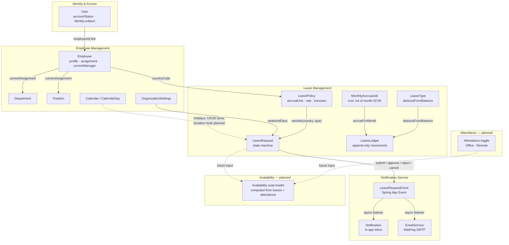
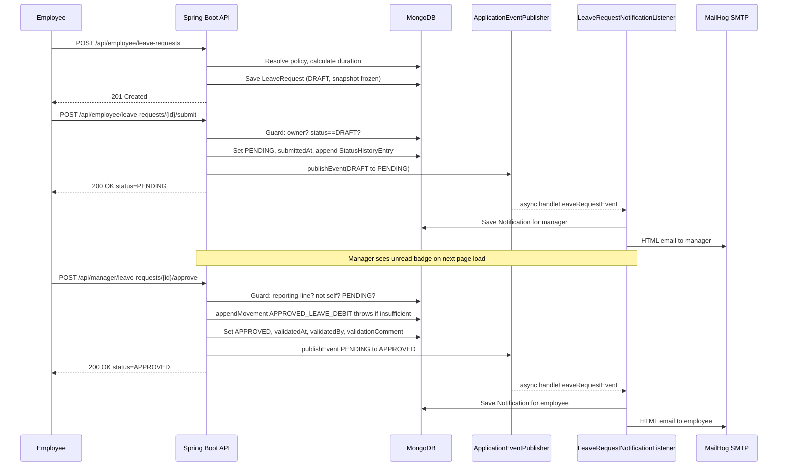
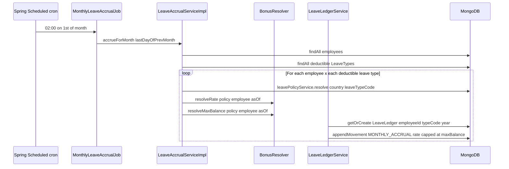
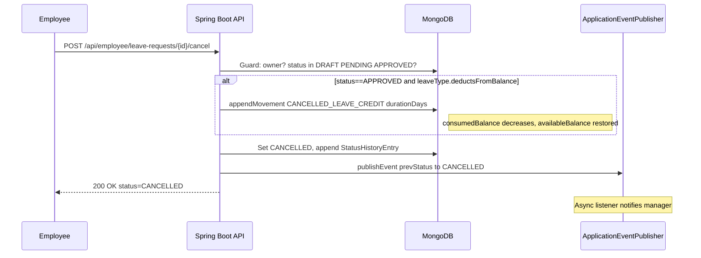

# Leave & Workforce Management System

> A production-grade leave management platform built on Spring Boot 4, MongoDB, Keycloak OIDC, and Angular 22 — replacing the email threads, shared spreadsheets, and approval chains that slow down every growing team.

---

## Table of Contents

1. [Product Overview](#1-product-overview)
2. [Architecture & Bounded Contexts](#2-architecture--bounded-contexts)
3. [API Reference](#3-api-reference)
4. [Use Cases](#4-use-cases)
5. [Key Workflows](#5-key-workflows)
6. [Getting Started](#6-getting-started)
7. [Demo Scenarios](#7-demo-scenarios)
8. [Technical Details](#8-technical-details)
9. [Roadmap — Deferred Features](#9-roadmap--deferred-features)

---

## 1. Product Overview

Managing employee leave across a growing organisation is deceptively hard. Requests land in inboxes, balances live in spreadsheets, approvals happen via instant messages, and HR spends hours reconciling who is where on any given day. When something breaks — a duplicate approval, a forgotten cancellation, a balance that does not add up — the trail is cold.

**Leave & Workforce Management** solves this by giving every actor in the process a structured, role-gated interface backed by an audit-proof data model:

| Actor | What they gain |
|-------|----------------|
| **Employee** | A self-service dashboard: live leave balance, request submission, request history, and instant in-app + email notifications the moment a decision is made. |
| **Manager** | A real-time approval queue scoped strictly to direct reports; one-click approve or reject with a required comment on rejections; full audit trail. |
| **HR Admin** | A workforce directory with CSV import/export, organisation master data (departments, positions, work calendars), leave policy configuration, and company settings. |
| **System Admin** | User account management — create, link to employees, and control account lifecycle — all role-protected. |

### What makes this different

- **Append-only leave ledger** — balances are never edited in place; every accrual, debit, and cancellation credit is a permanent movement entry. Auditing a balance means reading a journal, not guessing who changed a number.
- **Separated identity and employment** — a user account and an employee record are distinct documents. HR can onboard people before IT creates logins; admins can exist without being on the org chart.
- **Event-driven notifications** — the leave service publishes domain events; a decoupled listener creates in-app notifications and sends formatted HTML emails. Leave transactions never fail because a notification could not be delivered.
- **Reporting-line-based approval** — manager authority is enforced by the actual org chart edge (`currentManager.employeeId`), not by role label alone. A user who has no direct reports cannot approve anyone's leave.
- **Multi-country leave policies** — accrual rules are versioned by `(country, leaveTypeCode, effectiveFrom)`. Running a mixed Tunisia/France workforce is configuration, not code.

---

## 2. Architecture & Bounded Contexts

### Context map



### Bounded context responsibilities

#### Identity & Access

Owns `User` documents and the Keycloak OIDC integration. A `User` holds `email`, `accountStatus` (`PENDING_ACTIVATION` → `ACTIVE`), an optional `employeeId` link, and a `UserIdentity.subject` written on first successful login. Roles (`EMPLOYEE`, `HR`, `ADMIN`) live in the Keycloak realm and travel in the JWT; `SecurityConfig` maps `realm_access.roles` to Spring `GrantedAuthority` objects.

**No MANAGER role exists in Keycloak.** Manager authority is enforced at the service layer by the org-chart reporting-line edge (`Employee.currentManager.employeeId`). This is intentional — approval authority automatically follows org chart changes without any role synchronisation.

#### Employee Management

Owns employment records (`Employee`), org catalog (`Department`, `Position`), work calendars (`Calendar`, `CalendarDay`), and singleton company configuration (`OrganizationSettings`). Creating an employee does **not** create a user — the two records have independent lifecycles. Department and position labels are denormalised into `Employee.currentAssignment` at creation time for read performance.

#### Leave Management

The core of the product. Owns `LeaveType`, `LeavePolicy`, `LeaveRequest`, and `LeaveLedger`.

- **LeaveRequest** runs a strict state machine: `DRAFT → PENDING → APPROVED/REJECTED`, with `DRAFT/PENDING/APPROVED → CANCELLED` available to the owner at any point. Every transition is guarded, logged in `statusHistory`, and publishes a domain event.
- **LeaveLedger** is an append-only balance book keyed by `(employeeId, leaveTypeCode, year)`. Approval debits the balance; cancelling an approved request credits it back. Monthly accruals and future HR adjustments are also movements — nothing ever "sets" a balance directly.
- **MonthlyLeaveAccrualJob** runs via `@Scheduled(cron = "0 0 2 1 * *")` — at 02:00 on the 1st of every month it iterates all employees, resolves their active policy by `(country, leaveTypeCode, asOf)`, applies seniority bonuses via `BonusResolver`, and appends a `MONTHLY_ACCRUAL` movement to each ledger.
- Duration is calculated in **working days** (`AccrualUnit.WORKING_DAY`, excludes weekends from `OrganizationSettings.weekendDays`) or **calendar days** (`AccrualUnit.CALENDAR_DAY`, counts every day). Half-day flags reduce duration by 0.5 days each.

> **Known gap — no balance check at submit time.** The system currently checks balance only at **approve time**, not when the employee submits. An employee can submit a request that exceeds their balance; they discover this only when the manager tries to approve and gets an `INSUFFICIENT_BALANCE` error. The approval-time guard is hard — no balance can ever go negative — but the UX gap is tracked. See [§9 Roadmap](#9-roadmap--deferred-features).

#### Notification Service

Decoupled from leave transactions by Spring application events. `LeaveRequestNotificationListener` handles `LeaveRequestEvent` asynchronously — failures in notification delivery are logged and never roll back the leave operation.

Supported event types:
- `LEAVE_SUBMITTED` → notifies the manager
- `LEAVE_APPROVED` / `LEAVE_REJECTED` → notifies the employee
- `LEAVE_CANCELLED` → notifies the manager (if request was PENDING or APPROVED at time of cancellation)

In-app notifications are stored in MongoDB and surfaced via the notification bell in the Angular header. `EmailService` sends HTML MIME emails to MailHog (dev) or a real SMTP relay (production).

#### Attendance *(planned)*

No `Attendance` entity, controller, or service exists today. Designed as a daily Office/Remote toggle per employee, intended to feed the Availability read-model. See [§9](#9-roadmap--deferred-features).

#### Availability *(planned)*

A pure derived view computing per-employee daily status from approved leaves + attendance records + weekend rules. No computation, no storage, no endpoint exists today. The design intent (5 states: Office, Remote, On Leave, Not Logged In, Not a Working Day) is documented in [`md/design intent/DESIGN-DEV-README.md`](md/design%20intent/DESIGN-DEV-README.md). See [§9](#9-roadmap--deferred-features).

---

## 3. API Reference

**Interactive spec:** once the backend is running, the full Swagger UI is at `http://localhost:8080/swagger-ui.html` and the raw OpenAPI JSON at `http://localhost:8080/v3/api-docs` (powered by springdoc-openapi 2.8.5).

All endpoints require `Authorization: Bearer <access_token>` from Keycloak. Base URL: `http://localhost:8080`.

---

### 3.1 Employee actor — `/api/employee/**`

Requires: authenticated user with a linked, active employee record.

#### Self-service identity

| Method | Path | Description |
|--------|------|-------------|
| `GET` | `/api/employee` | Current user record |
| `GET` | `/api/employee/profile` | Current employee profile |

#### Leave requests

| Method | Path | Description |
|--------|------|-------------|
| `POST` | `/api/employee/leave-requests` | Create a draft leave request |
| `GET` | `/api/employee/leave-requests` | List own requests (all statuses) |
| `POST` | `/api/employee/leave-requests/{id}/submit` | Transition DRAFT → PENDING |
| `POST` | `/api/employee/leave-requests/{id}/cancel` | Cancel a DRAFT, PENDING, or APPROVED request |

**Create draft — request body:**
```json
{
  "leaveTypeCode": "PAID_ANNUAL",
  "startDate": "2026-10-06",
  "endDate": "2026-10-10",
  "halfDayStart": false,
  "halfDayEnd": false,
  "reason": "Annual holiday"
}
```
`leaveTypeCode` values (seeded): `PAID_ANNUAL`, `SICK`, `UNPAID`, `MATERNITY`.

**Cancel — request body (optional):**
```json
{ "reason": "Plans changed" }
```

**Leave request response shape:**
```json
{
  "id": "...",
  "employeeId": "...",
  "employeeSnapshot": {
    "employeeNumber": "EMP-001",
    "firstName": "Ahmed",
    "lastName": "Ben Salah",
    "email": "ahmed@acme.tn",
    "departmentLabel": "Engineering",
    "positionLabel": "Backend Developer"
  },
  "leaveTypeCode": "PAID_ANNUAL",
  "startDate": "2026-10-06",
  "endDate": "2026-10-10",
  "halfDayStart": false,
  "halfDayEnd": false,
  "durationDays": 5.0,
  "status": "DRAFT",
  "submittedAt": null,
  "statusHistory": [],
  "reason": "Annual holiday",
  "supportingDocuments": [],
  "validatedAt": null,
  "validatedBy": null,
  "validationComment": null
}
```

#### Leave ledger

| Method | Path | Description |
|--------|------|-------------|
| `GET` | `/api/employee/leave-ledgers` | List all leave ledgers for the current employee |
| `GET` | `/api/employee/leave-ledgers/{id}` | Get a ledger by ID (ownership-checked) |

**Ledger response shape:**
```json
{
  "id": "...",
  "employeeId": "...",
  "leaveTypeCode": "PAID_ANNUAL",
  "year": 2026,
  "accruedToDate": 15.0,
  "consumedBalance": 5.0,
  "carriedOverFromPreviousYear": 0.0,
  "availableBalance": 10.0,
  "movements": [
    {
      "date": "2026-01-01T02:00:00Z",
      "type": "MONTHLY_ACCRUAL",
      "amount": 1.83,
      "note": "January 2026 accrual",
      "leaveRequestId": null,
      "actorUserId": "system"
    }
  ]
}
```

---

### 3.2 Manager actor — `/api/manager/**`

Requires: authenticated user with a linked employee who has direct reports (enforced by reporting-line check, not by Keycloak role).

| Method | Path | Description |
|--------|------|-------------|
| `GET` | `/api/manager/team` | List direct reports with employment details |
| `GET` | `/api/manager/leave-requests/pending` | List pending requests from direct reports |
| `POST` | `/api/manager/leave-requests/{id}/approve` | Approve a pending request (comment optional) |
| `POST` | `/api/manager/leave-requests/{id}/reject` | Reject a pending request (**comment required**) |

**Approve body (optional):**
```json
{ "comment": "Approved. Have a great break!" }
```

**Reject body (required — validation error if blank or omitted):**
```json
{ "comment": "Sprint delivery scheduled for those dates." }
```

Business rules enforced in `LeaveRequestServiceImpl`:
- Caller must be the `currentManager` of the requester's employee record.
- A manager cannot approve or reject their own leave.
- Only `PENDING` requests are actionable.
- If `LeaveType.deductsFromBalance == true` and `availableBalance < durationDays`, approval throws `INSUFFICIENT_BALANCE` and the request stays `PENDING`.

---

### 3.3 HR Admin actor — `/api/hr/**`

Requires: JWT role `HR` or `ADMIN`.

#### Employee management

| Method | Path | Description |
|--------|------|-------------|
| `GET` | `/api/hr/employees` | List all employees |
| `GET` | `/api/hr/employees/{id}` | Get employee by ID |
| `POST` | `/api/hr/employees` | Create a new employee |
| `PATCH` | `/api/hr/employees/{id}` | Update employee (profile, status, assignment, manager) |

**Create employee body:**
```json
{
  "employeeNumber": "EMP-010",
  "employmentStatus": "ACTIVE",
  "firstName": "Sara",
  "lastName": "Hamdi",
  "gender": "F",
  "birthDate": "1995-03-22",
  "email": "sara.hamdi@acme.tn",
  "phone": "+21620000099",
  "hireDate": "2026-09-01",
  "initialAssignment": {
    "departmentId": "<dept-id>",
    "positionId": "<pos-id>",
    "startDate": "2026-09-01",
    "countryCode": "TN"
  },
  "managerEmployeeId": "<manager-employee-id>"
}
```

#### Leave policies

| Method | Path | Description |
|--------|------|-------------|
| `GET` | `/api/hr/leave-policies` | List policies (optional `?country=TN` or `?country=FR`) |
| `GET` | `/api/hr/leave-policies/{id}` | Get policy by ID |
| `POST` | `/api/hr/leave-policies` | Create a new policy version |

**Create policy body:**
```json
{
  "country": "TN",
  "leaveTypeCode": "PAID_ANNUAL",
  "accrualUnit": "WORKING_DAY",
  "accrualRate": 1.83,
  "maxBalance": 30.0,
  "minBlockDays": 1.0,
  "noticeDays": 3,
  "bonuses": []
}
```

`accrualUnit` values: `WORKING_DAY`, `CALENDAR_DAY`. Policies are append-only — creating a new policy version does not modify the existing one.

---

### 3.4 System Admin actor — `/api/admin/**`

Requires: JWT role `ADMIN`.

| Method | Path | Description |
|--------|------|-------------|
| `GET` | `/api/admin/users` | List all users |
| `GET` | `/api/admin/users/{id}` | Get user by ID |
| `POST` | `/api/admin/users` | Create a user account |
| `PATCH` | `/api/admin/users/{id}` | Update user (status, employee link) |

**Create user body:**
```json
{
  "email": "sara.hamdi@acme.tn",
  "employeeId": "<optional-employee-id>"
}
```

New users start with `accountStatus: PENDING_ACTIVATION`. The first successful Keycloak login activates the account and binds the Keycloak `sub` to `User.identity.subject`.

---

### 3.5 Shared reference data

All authenticated users can read; mutations are role-restricted.

| Method | Path | Role | Description |
|--------|------|------|-------------|
| `GET` | `/api/departments` | any | List departments |
| `POST` | `/api/departments` | HR / ADMIN | Create department |
| `GET` | `/api/positions` | any | List positions |
| `POST` | `/api/positions` | HR / ADMIN | Create position |
| `PATCH` | `/api/positions/{id}` | HR / ADMIN | Update position |
| `GET` | `/api/organization-settings` | any | Get company settings |
| `PUT` | `/api/organization-settings` | ADMIN | Update company settings |
| `GET` | `/api/calendars` | any | List work calendars |
| `POST` | `/api/calendars` | ADMIN | Create calendar |
| `PUT` | `/api/calendars/{id}` | ADMIN | Update calendar |
| `DELETE` | `/api/calendars/{id}` | ADMIN | Delete calendar |
| `GET` | `/api/calendars/{calendarId}/days` | any | List special days |
| `POST` | `/api/calendars/{calendarId}/days` | ADMIN | Add special day / holiday |
| `PUT` | `/api/calendars/{calendarId}/days/{dayId}` | ADMIN | Update a calendar day |
| `DELETE` | `/api/calendars/{calendarId}/days/{dayId}` | ADMIN | Delete a calendar day |
| `GET` | `/api/notifications` | any | List notifications for current user |
| `POST` | `/api/notifications/{id}/read` | any | Mark notification as read |

---

### 3.6 Error envelope

All error responses use a stable JSON envelope:

```json
{
  "error": {
    "code": "INSUFFICIENT_BALANCE",
    "message": "Insufficient leave balance to approve this request",
    "details": {},
    "requestId": "..."
  }
}
```

Business error codes used in leave flows: `INVALID_STATUS_TRANSITION`, `INSUFFICIENT_BALANCE`, `FORBIDDEN`, `RESOURCE_NOT_FOUND`, `DUPLICATE_RESOURCE`, `VALIDATION_ERROR`.

---

## 4. Use Cases

Each use case is cross-referenced to test evidence. `✅ tested` = unit-tested in the backend test suite. `☑️ implemented` = confirmed in code, no dedicated unit test for this specific case.

### Employee

| # | Use case | Evidence |
|---|----------|----------|
| E1 | **View leave balances** — dashboard shows circular gauge for paid annual and compact cards for sick/unpaid/maternity | ☑️ implemented (frontend + ledger API) |
| E2 | **Create a draft leave request** — select type, dates, optional half-day flags and reason; system calculates duration from policy accrual unit | ✅ `LeaveRequestServiceDurationTest` (3 scenarios: working-day, calendar-day, half-day) |
| E3 | **Submit a draft** — DRAFT → PENDING; manager receives in-app notification + HTML email | ✅ `LeaveRequestSubmitTest` (5 scenarios: success, not-found, forbidden-non-owner, invalid-transition, unlinked-user) |
| E4 | **Cancel a request** — cancels DRAFT, PENDING, or APPROVED; compensating ledger credit if APPROVED + deductible | ✅ `LeaveRequestCancelTest` (9 scenarios) + `LeaveLedgerServiceTest` (1 scenario) |
| E5 | **View request history and ledger movements** — full request list with status badges; ledger transaction log | ☑️ implemented |
| E6 | **View own employee profile** — `GET /api/employee/profile` returns assignment, manager reference, employment status | ☑️ implemented |
| E7 | **Receive and read notifications** — bell badge; dropdown with relative timestamps; click-to-mark-read | ✅ `NotificationServiceTest` (8 scenarios: submit/approve/reject/cancel events, list, mark-read, ownership guard, missing-manager skip) |

### Manager

| # | Use case | Evidence |
|---|----------|----------|
| M1 | **View pending team requests** — `GET /api/manager/leave-requests/pending` returns only direct reports' PENDING requests | ✅ `LeaveRequestDecisionTest::testListPendingTeamRequests` |
| M2 | **Approve a request** — reporting-line check, no self-approval, PENDING-only guard, ledger debit if deductible, APPROVED; employee notified | ✅ `LeaveRequestDecisionTest` (6 approval scenarios including insufficient-balance rollback) |
| M3 | **Reject a request** — same guards; comment required; no ledger movement; REJECTED; employee notified | ✅ `LeaveRequestDecisionTest` (4 rejection scenarios) |
| M4 | **List team** — `GET /api/manager/team` returns direct reports with profile and assignment details | ☑️ implemented |

### HR Admin

| # | Use case | Evidence |
|---|----------|----------|
| H1 | **Browse and search workforce** — full directory at `/management/employees` with status/text filtering, summary metrics | ☑️ implemented |
| H2 | **Create an employee** — with profile, initial assignment (department, position, country), and optional manager link | ☑️ implemented |
| H3 | **Update an employee** — profile, employment status, assignment, manager via `PATCH /api/hr/employees/{id}` | ☑️ implemented |
| H4 | **CSV bulk import** — 3-step wizard: upload → validate (per-row error badges) → import; template download; export also available | ☑️ implemented |
| H5 | **Manage departments and positions** — CRUD at `/management/organization` | ☑️ implemented |
| H6 | **Manage work calendars and public holidays** — Calendar + CalendarDay CRUD; Tunisian 2026 holidays pre-seeded | ☑️ implemented |
| H7 | **Company settings** — update country, timezone, weekend days | ☑️ implemented |
| H8 | **View and create leave policies** — list by country, create new versioned policy | ☑️ implemented |

### System Admin

| # | Use case | Evidence |
|---|----------|----------|
| S1 | **Create a user account** — `POST /api/admin/users`; starts `PENDING_ACTIVATION`; activates on first login | ☑️ implemented |
| S2 | **Update user** — status, employee link | ☑️ implemented |
| S3 | **List users** — `GET /api/admin/users` | ☑️ implemented |

---

## 5. Key Workflows

### 5.1 Leave request: submit → decision → notification



### 5.2 Monthly leave accrual job



### 5.3 Leave cancellation with ledger reversal



---

## 6. Getting Started

### Prerequisites

- [Docker Desktop](https://docs.docker.com/get-docker/)
- Java 21+ (backend targets Java 26; Spring Boot 4 requires Java 21 minimum)
- Node.js 20+ and `npm`
- Maven wrapper included at `backend/mvnw`

### Step 1 — Start infrastructure

```bash
docker compose up -d
```

| Service | Port | Notes |
|---------|------|-------|
| MongoDB 7 (replica set `rs0`) | `27017` | Replica set required for Flamingock multi-document transactions |
| Mongo Express | `8888` | Visual DB browser — login: `admin` / `admin` |
| Keycloak 26.5 | `9090` | Admin console: `admin` / `admin` |
| MailHog | `1025` SMTP / `8025` web | Captures all dev emails |

### Step 2 — Import the Keycloak realm

`leave-workforce-realm.json` at the repository root is a complete realm export. **It is not imported automatically** — the compose file does not pass `--import-realm`.

**Option A — Admin Console UI:**
1. Open `http://localhost:9090` → log in as `admin` / `admin`
2. Realm dropdown (top-left) → **Create Realm** → Browse → select `leave-workforce-realm.json` → **Create**

**Option B — exec into container:**
```bash
docker cp leave-workforce-realm.json leave-keycloak:/tmp/realm.json
docker exec leave-keycloak /opt/keycloak/bin/kc.sh import --file /tmp/realm.json
```

After import, create test users in the `leave-workforce` realm and assign the `EMPLOYEE`, `HR`, or `ADMIN` realm role. For Google OIDC login, configure the Google Identity Provider (client ID and secret from Google Cloud Console required).

### Step 3 — Verify backend configuration

`backend/src/main/resources/application.yaml` defaults work for local Docker Compose. Key properties:

```yaml
spring:
  security:
    oauth2:
      resourceserver:
        jwt:
          issuer-uri: http://localhost:9090/realms/leave-workforce
  data:
    mongodb:
      uri: mongodb://localhost:27017/leave_management?replicaSet=rs0
  mail:
    host: localhost
    port: 1025
```

### Step 4 — Start the backend

```bash
cd backend
./mvnw spring-boot:run
```

On first boot, Flamingock runs five migrations automatically:

| Migration | Seeds |
|-----------|-------|
| `_0001__SeedReferenceData` | Departments, positions, `OrganizationSettings` (country: TN, weekends: Sat+Sun) |
| `_0002__SeedLeaveCatalog` | Leave types (`PAID_ANNUAL`, `SICK`, `UNPAID`, `MATERNITY`) + versioned policies for TN and FR with seniority bonuses |
| `_0003__SeedCalendar` | Tunisian national holiday calendar for 2026 |
| `_0004__SeedDemoWorkforce` | 6 employees + 7 user accounts (see §7 for the cast) |
| `_0005__SeedLeaveActivity` | Realistic leave ledgers and requests covering all status values: APPROVED, PENDING, DRAFT, REJECTED, CANCELLED |

Migrations are idempotent — safe to restart without duplicating data.

### Step 5 — Start the frontend

```bash
cd frontend
npm install
npm start
```

Angular dev server at `http://localhost:4200`.

### Step 6 — Log in

Navigate to `http://localhost:4200/login` → **Continue with Google** (if Google IdP configured) or log in with a Keycloak-local user. First login activates the account and links the Keycloak subject to the seeded user record by email match.

**Swagger UI:** `http://localhost:8080/swagger-ui.html`
**MailHog web:** `http://localhost:8025`
**Mongo Express:** `http://localhost:8888`

---

## 7. Demo Scenarios

### Seeded cast

| Name | Role | Keycloak role | Manager |
|------|------|---------------|---------|
| Salma Trabelsi | Engineering Manager | `EMPLOYEE` | — |
| Ahmed Ben Salah | Backend Developer | `EMPLOYEE` | Salma |
| Yosra Khelifi | Frontend Developer | `EMPLOYEE` | Salma |
| Karim Ben Ammar | Backend Developer (TN) | `EMPLOYEE` | Salma |
| Camille Dupont | Frontend Developer (FR) | `EMPLOYEE` | Salma |
| Leila Mansouri | HR Specialist | `HR` | — |
| *(admin)* | System Admin | `ADMIN` | — (no employee record) |

> The seed uses real Google account emails for development. For a clean demo environment, create Keycloak-local users with matching emails and assign roles — the backend links by email on first login.

---

### Scenario 1 — Employee submits a leave request

**What it demonstrates:** DRAFT → PENDING flow, duration calculation, manager notification.

1. Log in as **Ahmed Ben Salah**.
2. Dashboard shows his paid annual balance — the ledger already has accrual movements from the seed.
3. Click **Request Leave** → select `PAID ANNUAL`, pick a future date range. Optionally set a half-day flag and observe `durationDays` adjust.
4. Save draft — appears in request list with amber `DRAFT` badge.
5. Click **Submit** — badge changes to blue `PENDING`.
6. Open `http://localhost:8025` (MailHog) — a formatted HTML email to Salma is waiting.
7. Log in as **Salma Trabelsi** — notification bell shows unread badge; clicking reveals the request details.

---

### Scenario 2 — Manager approves; balance debits; employee notified

**What it demonstrates:** Approval flow, ledger debit, event-driven notification.

1. As **Salma**, navigate to `/manager/approvals`.
2. The seeded PENDING request from Ahmed (and Karim) appears in the queue.
3. Click **Approve** on Ahmed's request; optionally add a comment.
4. Return to dashboard — Ahmed's available balance has decreased by `durationDays`.
5. Log in as **Ahmed** — notification bell shows `LEAVE_APPROVED`; message includes Salma's comment.
6. `GET /api/employee/leave-ledgers` shows the `APPROVED_LEAVE_DEBIT` movement in the journal.

---

### Scenario 3 — Manager rejects; comment enforced

**What it demonstrates:** Rejection guard, required comment validation, employee notification.

1. As **Salma**, find a PENDING request in `/manager/approvals`.
2. Click **Reject** — attempt to submit without a comment. The form blocks submission (`comment` is `@NotBlank` in `RejectLeaveRequest` DTO, validated server-side).
3. Enter a reason → confirm. Request transitions to `REJECTED`.
4. Log in as the requesting employee — `LEAVE_REJECTED` notification includes Salma's reason.

---

### Scenario 4 — HR admin imports employees via CSV

**What it demonstrates:** Bulk import wizard with per-row validation feedback.

1. Log in as **Leila Mansouri** (HR role).
2. Navigate to `/management/employees` — see the full workforce directory.
3. Click **Export CSV** — download the current directory as a file.
4. Edit the CSV: add a new valid row; introduce a deliberate error in another row (e.g. `hireDate` in the wrong format).
5. Click **Import CSV** → Step 1: drag-and-drop the modified file.
6. Step 2 — Review: the error row is highlighted inline; the valid row shows a checkmark. Preview is capped at 20 rows.
7. Fix the error, re-import — Step 3 reports import count and any errors.

---

## 8. Technical Details

### Stack

| Layer | Technology |
|-------|-----------|
| Runtime | Java 26, Spring Boot 4.1.1 |
| Web | Spring MVC (`spring-boot-starter-webmvc`) |
| Persistence | MongoDB 7 (replica set `rs0`), Spring Data MongoDB |
| Migrations | Flamingock 1.4.5 (compile-time annotation processing, rollback support) |
| Auth | Keycloak 26.5 (OIDC, optional Google broker), Spring Security OAuth2 Resource Server |
| Mapping | MapStruct 1.6.3 + Lombok |
| API docs | springdoc-openapi 2.8.5 |
| Mail | Spring Boot Mail → MailHog (dev) |
| Scheduling | Spring `@Scheduled` — monthly accrual cron |
| Frontend | Angular 22.1, Angular Material (M3), Tailwind CSS, `angular-oauth2-oidc`, FullCalendar |
| Container | Docker Compose (infrastructure only — backend and frontend run on host) |

### Design decisions

**Append-only leave ledger**
`LeaveLedger` maintains running aggregates (`accruedToDate`, `consumedBalance`, `availableBalance`) but these are always derived by appending a movement — never by writing to the aggregate field directly. Every change is a named, permanent journal entry with an actor, timestamp, and optional note. Balance reconciliation and audit are trivial: replay the `movements[]` array.

**Identity separate from employment**
`User` (Keycloak subject + role) and `Employee` (HR record + reporting line) are independent MongoDB documents, linked by `User.employeeId`. This enables: HR to onboard employees before IT creates logins; system admins who are not on the org chart; leave requests that remain historically meaningful even if the person later changes name or department (the request stores a frozen `EmployeeSnapshot` at draft time).

**Reporting-line-based manager authority**
`LeaveRequestServiceImpl.assertManagerOf()` checks `employee.currentManager.employeeId == callingUser.employeeId`. There is no MANAGER role in Keycloak. Changing who manages someone in the HR directory immediately changes who can approve their leave — no role re-assignment required, no synchronisation lag.

**Event-driven notifications**
`LeaveRequestServiceImpl` publishes a `LeaveRequestEvent` after every status transition. `LeaveRequestNotificationListener` handles it `@Async`. The leave database transaction completes independently of notification delivery — a broken SMTP server cannot cause a leave approval to fail.

**Versioned leave policies**
Policies are immutable once created. `leavePolicyService.resolve(country, leaveTypeCode, asOf)` returns the latest active policy for a given date. Changing accrual rules mid-year creates a new policy version with a new `effectiveFrom` — existing ledger movements are not retroactively altered.

**Seniority-aware accrual via BonusResolver**
`BonusResolver` reads `LeaveBonus` rules from the policy and applies them during monthly accrual. Bonuses can increase the accrual rate (additive or override) or raise the max balance cap, conditioned on years of service, employee age, or periodic thresholds (`everyNYears`). This allows Tunisia's statutory seniority-linked leave entitlements to be expressed as configuration rather than code.

**Duration respects policy accrual unit**
`WORKING_DAY` policies skip days whose `dayOfWeek` number matches `OrganizationSettings.weekendDays`. `CALENDAR_DAY` policies count every day. Half-day flags subtract 0.5. Public holiday subtraction from working-day counts is the only missing piece — see §9.

---

## 9. Roadmap — Deferred Features

These features are absent by design choice, not oversight. The core leave lifecycle (draft, submit, approve/reject, cancel, ledger, notifications, accrual) is complete and usable. The items below are natural next iterations that do not block any current capability.

---

### EligibilityService — balance and overlap check at submit time

**Current behaviour:** Balance is checked only when the manager approves. An employee can submit any request regardless of balance; the `INSUFFICIENT_BALANCE` error surfaces to the manager, not the employee.

**Why it is deferred:** The approval-time guard is a hard invariant — no balance can go negative. The missing piece is early feedback to the employee. Adding an `EligibilityService` at submit time is a UX improvement, not a correctness fix.

**Planned scope:**
- Employee `ACTIVE` check on submit
- `availableBalance >= durationDays` check on submit (if `leaveType.deductsFromBalance`)
- Overlap detection against existing APPROVED requests for the same period
- Minimum block days enforcement from policy (`minBlockDays`)
- Optional: `POST /api/employee/leave-requests/{id}/eligibility-check` for live dashboard feedback while editing a draft

---

### Attendance tracking

**Current behaviour:** No `Attendance` entity, service, or endpoint exists.

**Why it is deferred:** Attendance is a quality-of-life feature that feeds the Availability read-model. All core leave management works without it.

**Planned scope:**
- `Attendance` entity: `(employeeId, date, presenceStatus: OFFICE | REMOTE, source: SELF | SYSTEM)`
- `POST /api/employee/attendance/today` — daily self-service toggle (header widget in the UI design)
- `GET /api/employee/attendance?from=&to=` — personal attendance log

---

### Availability read-model

**Current behaviour:** `GET /api/manager/team` returns team roster and employment details but no computed daily status.

**Why it is deferred:** Depends on Attendance. Availability is a pure derived view — no business transactions depend on it. It can be added without touching any existing service.

**Planned scope:**
- `GET /api/manager/team/availability?date=` returning per-member status: `OFFICE`, `REMOTE`, `ON_LEAVE`, `NOT_LOGGED_IN`, `NOT_A_WORKING_DAY`
- Colour system deliberately separate from the request-lifecycle colours (no reuse of Approved-green / Rejected-red for availability states)
- FullCalendar team view integration

---

### HR leave adjustment endpoint

**Current behaviour:** `LeaveLedgerService.adjust()` is declared in the service interface; movement types `HR_ADJUSTMENT_CREDIT`, `HR_ADJUSTMENT_DEBIT`, `CORRECTION_CREDIT`, `CORRECTION_DEBIT` are fully implemented; `LeaveAdjustmentRequest` DTO exists. No controller exposes this capability.

**Why it is deferred:** Ledger mechanics are ready. Missing only: one controller endpoint and the HR UI panel.

**Planned scope:**
- `POST /api/hr/leave-adjustments` — HR records a named debit or credit with mandatory reason
- UI form copy: "Record Adjustment" not "Edit Balance" — to communicate the append-only model to HR users

---

### HR org-wide leave request view

**Current behaviour:** No `GET /api/hr/leave-requests` endpoint. HR can manage employees and policies but cannot browse the organisation's leave requests.

**Why it is deferred:** Purely additive — a new read-only controller over the existing `LeaveRequestRepository`. No data model changes required.

**Planned scope:**
- `GET /api/hr/leave-requests?department=&status=&from=&to=` — paginated, filterable read-only list
- HR cannot approve or reject (manager authority only); HR cancel capability to be decided separately

---

### Calendar-affecting duration calculation

**Current behaviour:** Public holidays are fully managed (CRUD, Tunisian 2026 calendar pre-seeded). They are **not** subtracted from working-day leave duration. A request spanning a national holiday consumes one working-day of balance that it should not.

**Why it is deferred:** This is one targeted change in `LeaveRequestServiceImpl.calculateDuration()` — query the relevant calendar for holidays in the date range and subtract from the working-day count. Deferred pending a decision on calendar selection per employee (country-code match vs. explicit calendar assignment on the employee record).

---

*This README reflects the codebase as of 2026-09-17. All API paths, request/response shapes, and described behaviours are derived from controller source, DTO definitions, service implementations, and the backend unit test suite (`LeaveRequestSubmitTest`, `LeaveRequestDecisionTest`, `LeaveRequestCancelTest`, `LeaveRequestServiceDurationTest`, `LeaveLedgerServiceTest`, `NotificationServiceTest`). Gaps are stated plainly. See `md/PROJECT_STATUS.md` for the living status log.*
