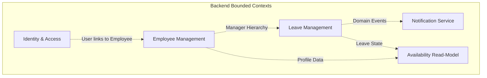
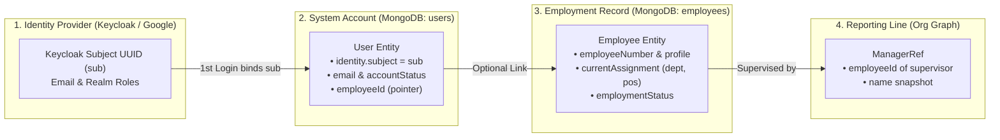
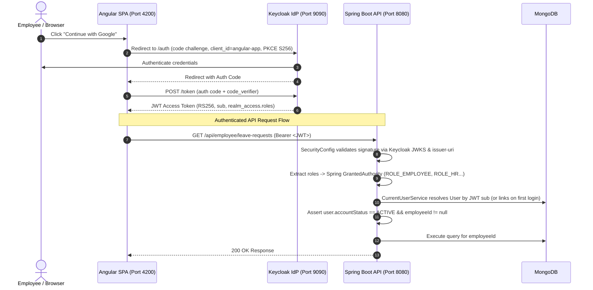
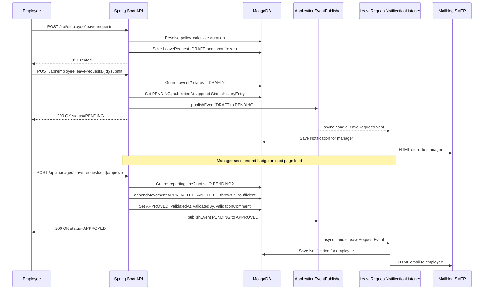
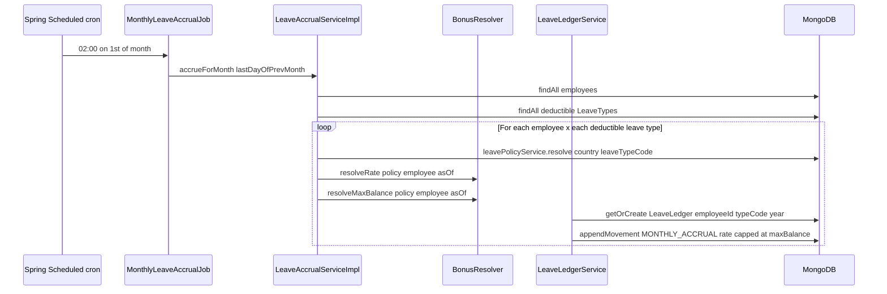
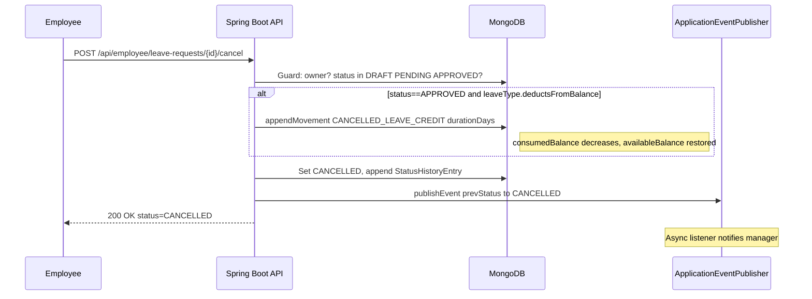
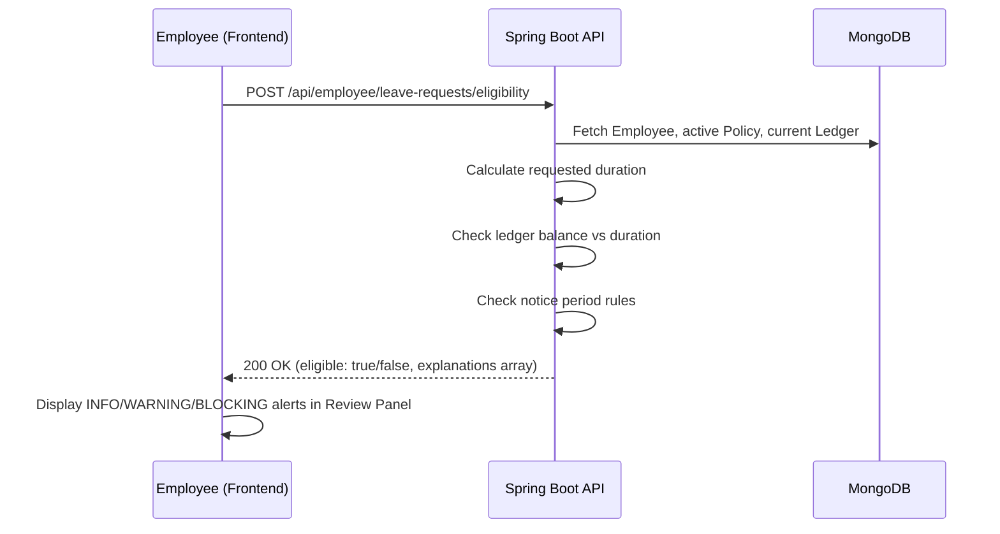
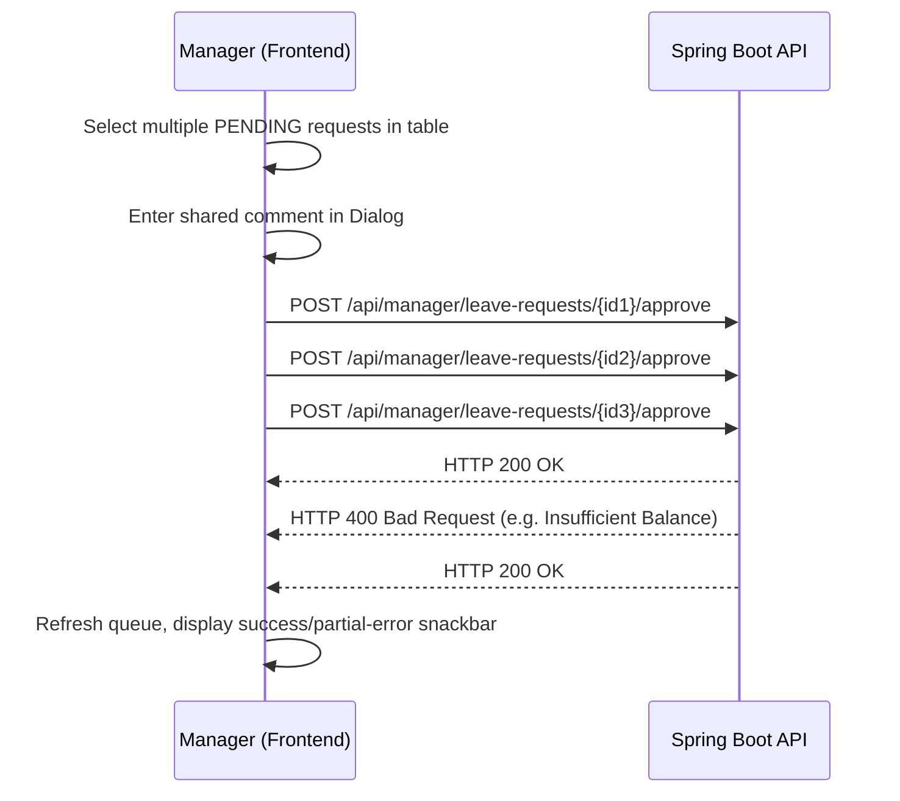
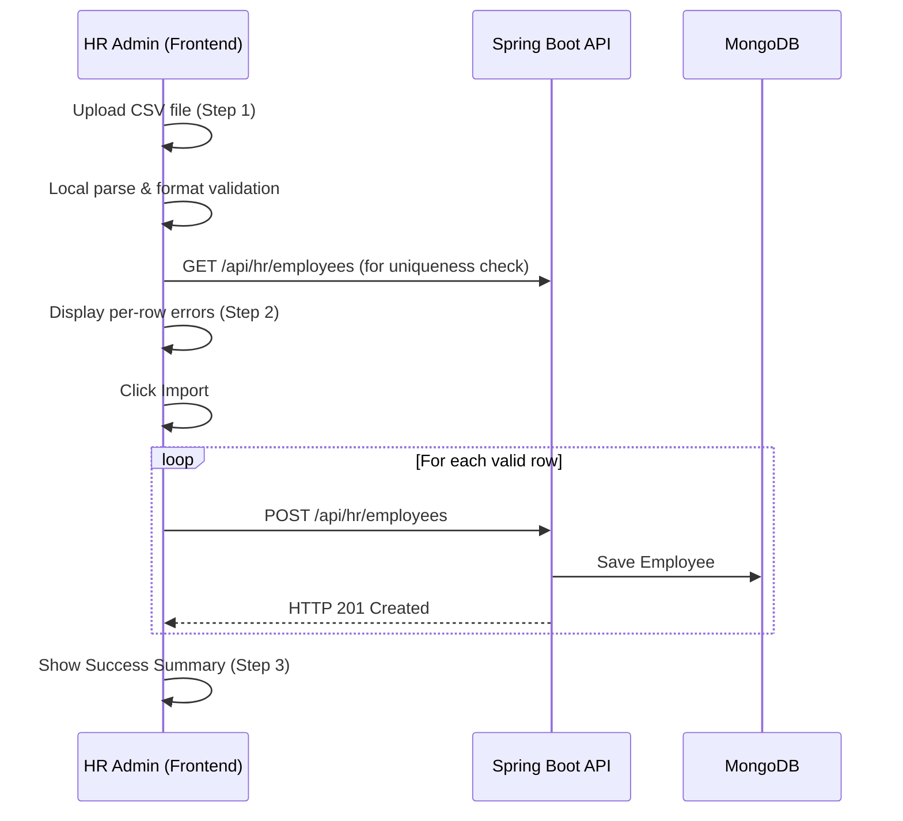
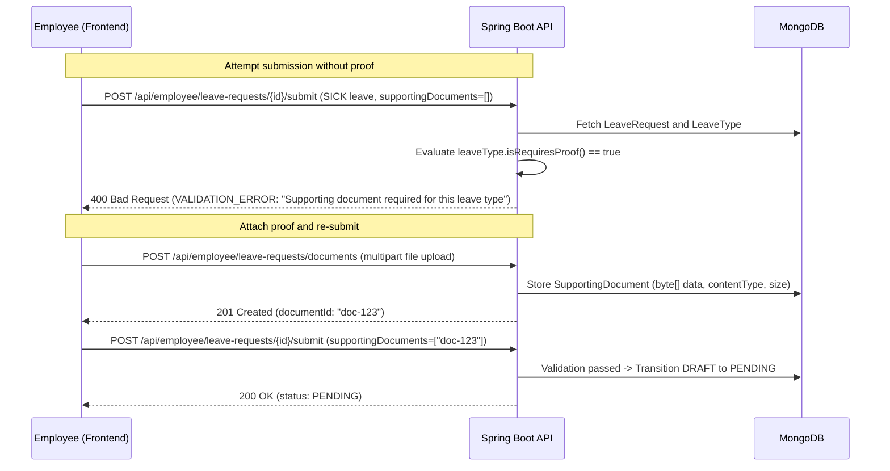

The project involves developing a secure, web-based and centralized Leave Management System that simpify the entire leave process, from employee request to manager approval.

| Layer                             | Technology                                     |
| --------------------------------- | ---------------------------------------------- |
| **Frontend**                      | Angular 22 + Angular Material + Apache ECharts |
| **Backend**                       | Spring Boot 4                                  |
| **Database**                      | MongoDB                                        |
| **Authentication**                | Keycloak (OAuth 2.0)                           |
| **Email Testing**                 | MailHog                                        |
| **Database Migrations / Seeding** | FlaminGock                                     |

---

## Getting Started

```bash
docker compose up -d
```

credentials: admin/admin

|Service|URL|Description|
|---|---|---|
|**Keycloak**|[http://localhost:9090](http://localhost:9090)|OAuth / authentication server|
|**Mongo Express**|[http://localhost:8888](http://localhost:8888)|MongoDB administration|
|**MailHog**|[http://localhost:8025](http://localhost:8025)|Email testing interface|
|**Swagger UI**|[http://localhost:8080/swagger-ui/index.html](http://localhost:8080/swagger-ui/index.html)|Backend API documentation|

After starting Keycloak, import the secret realm configuration:
```text
leave-workforce-realm.json
```

---

## Backend

Navigate to the backend directory:

```bash
cd backend
.\mvnw spring-boot:run
```

The backend will be available on: `http://localhost:8080`

> Seed data is loaded through **FlaminGock migrations**.

> To reset MongoDB and keep only the seed data, remove the MongoDB Docker volume, Then restart the services so the database is initialized again with the seed data.

```bash
docker volume rm leave-management-webapp-pfa_mongo_data
```

---

## Frontend

```bash
cd frontend
npm install
ng serve
```

The backend will be available on: `http://localhost:4200`

# Expanding

## 1. Product Overview

Managing employee leave across a growing organisation is deceptively hard. Requests land in inboxes, balances live in spreadsheets, approvals happen via instant messages, and HR spends hours reconciling who is where on any given day. When something breaks — a duplicate approval, a forgotten cancellation, a balance that does not add up — the trail is cold.

**Leave & Workforce Management** solves this by giving every actor in the process a structured, role-gated interface backed by an audit-proof data model:

| Actor | What they gain |
|-------|----------------|
| **Employee** | A self-service dashboard: live leave balance, request submission, request history, and instant in-app + email notifications the moment a decision is made. |
| **Manager** | A real-time approval queue scoped strictly to direct reports; one-click approve or reject with a required comment on rejections; full audit trail. |
| **HR Admin** | A workforce directory with CSV import/export, organisation master data (departments, positions, work calendars), leave policy configuration, and company settings. |
| **System Admin** | User account management — create, link to employees, and control account lifecycle — all role-protected. |

### What Makes This Different

- **Append-only leave ledger** — balances are never edited in place; every accrual, debit, and cancellation credit is a permanent movement entry. Auditing a balance means reading a journal, not guessing who changed a number.
- **Separated identity and employment** — a user account and an employee record are distinct documents. HR can onboard people before IT creates logins; admins can exist without being on the org chart.
- **Event-driven notifications** — the leave service publishes domain events; a decoupled listener creates in-app notifications and sends formatted HTML emails. Leave transactions never fail because a notification could not be delivered.
- **Reporting-line-based approval** — manager authority is enforced by the actual org chart edge (`currentManager.employeeId`), not by role label alone. A user who has no direct reports cannot approve anyone's leave.
- **Multi-country leave policies** — accrual rules are versioned by `(country, leaveTypeCode, effectiveFrom)`. Running a mixed Tunisia/France workforce is configuration, not code.

---

## 2. Architecture & Bounded Contexts

### Bounded Contexts

> Briefly: each context owns its data and exposes it to the others through events or read APIs, nobody reaches into another context's collections directly.



| Context                       | Owns                                                                                                   | Answers                                                                    |
| ----------------------------- | ------------------------------------------------------------------------------------------------------ | -------------------------------------------------------------------------- |
| **Identity & Access**         | User Account, Role/Permission mapping, authentication configuration, session context                   | "What can this user do?"                                                   |
| **Employee Management**       | Employee, Department, Position, Contract, Reporting Relationship                                       | "Who is employed, as what, under whom?"                                    |
| **Leave Management**          | Leave Type, Leave Policy, Accrual Rules, Leave Ledger, Leave Balance, Leave Request, Approval Workflow | "Is this person entitled to leave, and what's the state of their request?" |
| **Availability** (read-model) | Aggregated, derived view over Employee + Leave + Attendance                                            | "Who's available right now?"                                               |
| **Notification Service**      | Notification, delivery channel                                                                         | "Who needs to know, and how do we tell them?"                              |

### Bounded Context Responsibilities

#### Identity & Access

Owns `User` documents and the Keycloak OIDC integration. A `User` holds `email`, `accountStatus` (`PENDING_ACTIVATION` → `ACTIVE`), an optional `employeeId` link, and a `UserIdentity.subject` written on first successful login. Roles (`EMPLOYEE`, `HR`, `ADMIN`) live in the Keycloak realm and travel in the JWT; `SecurityConfig` maps `realm_access.roles` to Spring `GrantedAuthority` objects.

#### Employee Management

Owns employment records (`Employee`), org catalog (`Department`, `Position`), work calendars (`Calendar`, `CalendarDay`), and singleton company configuration (`OrganizationSettings`). Creating an employee does **not** create a user — the two records have independent lifecycles. Department and position labels are denormalised into `Employee.currentAssignment` at creation time for read performance.

#### Leave Management

The core of the product. Owns `LeaveType`, `LeavePolicy`, `LeaveRequest`, and `LeaveLedger`.

- **LeaveRequest** runs a strict state machine: `DRAFT → PENDING → APPROVED/REJECTED`, with `DRAFT/PENDING/APPROVED → CANCELLED` available to the owner at any point. Every transition is guarded, logged in `statusHistory`, and publishes a domain event.
- **LeaveLedger** is an append-only balance book keyed by `(employeeId, leaveTypeCode, year)`. Approval debits the balance; cancelling an approved request credits it back. Monthly accruals and future HR adjustments are also movements — nothing ever "sets" a balance directly.
- **MonthlyLeaveAccrualJob** runs via `@Scheduled(cron = "0 0 2 1 * *")` — at 02:00 on the 1st of every month it iterates all employees, resolves their active policy by `(country, leaveTypeCode, asOf)`, applies seniority bonuses via `BonusResolver`, and appends a `MONTHLY_ACCRUAL` movement to each ledger.
- Duration is calculated in **working days** (`AccrualUnit.WORKING_DAY`, excludes weekends from `OrganizationSettings.weekendDays`) or **calendar days** (`AccrualUnit.CALENDAR_DAY`, counts every day). Half-day flags reduce duration by 0.5 days each.

#### Notification Service

Decoupled from leave transactions by Spring application events. `LeaveRequestNotificationListener` handles `LeaveRequestEvent` asynchronously — failures in notification delivery are logged and never roll back the leave operation.

Supported event types:
- `LEAVE_SUBMITTED` → notifies the manager
- `LEAVE_APPROVED` / `LEAVE_REJECTED` → notifies the employee
- `LEAVE_CANCELLED` → notifies the manager (if request was PENDING or APPROVED at time of cancellation)

In-app notifications are stored in MongoDB and surfaced via the notification bell in the Angular header. `EmailService` sends HTML MIME emails to MailHog (dev) or a real SMTP relay (production).

---

### 2.1 Core Domain Modeling: The 4 Dimensions of a Person

A foundational architectural decision in this system is that **identity, system account, employment record, and reporting authority are deliberately separated**:



| Dimension | Concept | Storage | Responsibility |
|-----------|---------|---------|----------------|
| **1. Identity** | OAuth2 Subject (`sub`) | Keycloak (JWT) | Cryptographic proof of who the user is. Never touches DB directly. |
| **2. Account** | `User` | `users` collection | Manages system access lifecycle (`PENDING_ACTIVATION`, `ACTIVE`, `SUSPENDED`, `ARCHIVED`). Can exist without an employee record (e.g. system admins). |
| **3. Employment** | `Employee` | `employees` collection | HR master record (hire date, department, position, tenure). Can be onboarded by HR prior to IT account creation. |
| **4. Authority** | `currentManager` | `employees.currentManager` | Enforces approval rights. Manager authority is governed by **the org graph**, not by static Keycloak roles. |

---

### 2.2 The Append-Only Balance Book (Ledger Invariants)

The system enforces strict journal accounting for leave balances. Balances are never modified in place:

```text
availableBalance = accruedToDate + carriedOverFromPreviousYear - consumedBalance
```

Every balance change is represented by an immutable `LedgerMovement`:

| Movement Type | Trigger | Amount Sign | Effect on Ledger |
|---------------|---------|-------------|------------------|
| `MONTHLY_ACCRUAL` | Cron job (`MonthlyLeaveAccrualJob`) | `+` Positive | Increases `accruedToDate` (capped at `maxBalance`) |
| `APPROVED_LEAVE_DEBIT` | Manager approves deductible request | `+` Positive | Increases `consumedBalance`, debits `availableBalance` |
| `CANCELLED_LEAVE_CREDIT` | Employee cancels an `APPROVED` request | `-` Negative | Decreases `consumedBalance`, restores `availableBalance` |
| `ADJUSTMENT` | HR manual adjustment | `+/-` Delta | Adjusts accrual or consumption with mandatory audit note |

---

### 2.3 Security & Authentication Architecture

Authentication uses OpenID Connect (OIDC) Authorization Code flow with **PKCE (Proof Key for Code Exchange)**.



#### Dual-Layer Access Control Model:
1. **Frontend Layer (UX Guarding)**:
   - `employeeGuard`: Ensures valid access token, invokes `MeService` to verify `accountStatus === 'ACTIVE'` and linked employee profile. Inactive users are redirected to `/no-profile`.
   - `hrGuard`: Checks JWT payload for realm roles `HR` or `ADMIN`. Unauthorized users are routed to `/dashboard`.
2. **Backend Layer (Authoritative Security)**:
   - `SecurityConfig`: Path-level rules (e.g. `/api/admin/**` requires `ROLE_ADMIN`, `/api/hr/**` requires `ROLE_HR` or `ROLE_ADMIN`).
   - Method-level `@PreAuthorize`: Enforces roles on controller methods.
   - Domain-level reporting checks: `assertManagerOf()` in `LeaveRequestServiceImpl` verifies that `currentManager.employeeId == callingUser.employeeId`.

---

## 3. API Reference

**Interactive spec:** once the backend is running, the full Swagger UI is at `http://localhost:8080/swagger-ui.html` and the raw OpenAPI JSON at `http://localhost:8080/v3/api-docs` (powered by springdoc-openapi 2.8.5).

All endpoints require `Authorization: Bearer <access_token>` from Keycloak. Base URL: `http://localhost:8080`.

---

### 3.1 Employee Actor — `/api/employee/**`

Requires: authenticated user with a linked, active employee record.

#### Self-service Identity

| Method | Path | Description |
|--------|------|-------------|
| `GET` | `/api/employee` | Current user record |
| `GET` | `/api/employee/profile` | Current employee profile |

#### Leave Requests

| Method | Path | Description |
|--------|------|-------------|
| `POST` | `/api/employee/leave-requests` | Create a draft leave request |
| `GET` | `/api/employee/leave-requests` | List own requests (all statuses) |
| `POST` | `/api/employee/leave-requests/{id}/submit` | Transition DRAFT → PENDING |
| `POST` | `/api/employee/leave-requests/{id}/cancel` | Cancel a DRAFT, PENDING, or APPROVED request |

**Create draft — request body:**
```json
{
  "leaveTypeCode": "PAID_ANNUAL",
  "startDate": "2026-10-06",
  "endDate": "2026-10-10",
  "halfDayStart": false,
  "halfDayEnd": false,
  "reason": "Annual holiday"
}
```
`leaveTypeCode` values (seeded): `PAID_ANNUAL`, `SICK`, `UNPAID`, `MATERNITY`.

**Cancel — request body (optional):**
```json
{ "reason": "Plans changed" }
```

**Leave request response shape:**
```json
{
  "id": "...",
  "employeeId": "...",
  "employeeSnapshot": {
    "employeeNumber": "EMP-001",
    "firstName": "Ahmed",
    "lastName": "Ben Salah",
    "email": "ahmed@acme.tn",
    "departmentLabel": "Engineering",
    "positionLabel": "Backend Developer"
  },
  "leaveTypeCode": "PAID_ANNUAL",
  "startDate": "2026-10-06",
  "endDate": "2026-10-10",
  "halfDayStart": false,
  "halfDayEnd": false,
  "durationDays": 5.0,
  "status": "DRAFT",
  "submittedAt": null,
  "statusHistory": [],
  "reason": "Annual holiday",
  "supportingDocuments": [],
  "validatedAt": null,
  "validatedBy": null,
  "validationComment": null
}
```

#### Eligibility Pre-check

| Method | Path | Description |
|--------|------|-------------|
| `POST` | `/api/employee/leave-requests/eligibility` | Check eligibility for a leave request before submitting |

Call this before creating a draft to surface balance, policy, and notice-period issues with human-readable explanations. The response never blocks the request (the employee can still save a draft) — it is advisory.

**Request body:**
```json
{
  "leaveTypeCode": "PAID_ANNUAL",
  "startDate": "2026-10-06",
  "endDate": "2026-10-10",
  "halfDayStart": false,
  "halfDayEnd": false
}
```

**Response shape:**
```json
{
  "eligible": true,
  "blockingCode": null,
  "reasons": [],
  "explanations": [
    {
      "code": "BALANCE_OK",
      "severity": "INFO",
      "title": "Sufficient balance",
      "body": "You have 10.0 days available; this request requires 5.0 days."
    },
    {
      "code": "NOTICE_WARNING",
      "severity": "WARNING",
      "title": "Short notice",
      "body": "Policy recommends at least 3 days notice. Your request starts in 2 days."
    }
  ]
}
```

`severity` values: `INFO` (green), `WARNING` (amber), `BLOCKING` (red — `eligible` will be `false`).

Common `blockingCode` values: `INSUFFICIENT_BALANCE`, `LEAVE_TYPE_NOT_FOUND`, `NO_ACTIVE_POLICY`.

#### Supporting Documents

| Method | Path | Description |
|--------|------|-------------|
| `POST` | `/api/employee/leave-requests/documents` | Upload a supporting document (multipart/form-data) |
| `GET` | `/api/documents/{id}` | View or download document by ID (inline content-disposition) |
| `GET` | `/api/documents/{id}/metadata` | Get document metadata (filename, content-type, size) |

Documents are stored as binary in MongoDB. Upload accepts any file type; the `GET /api/documents/{id}` endpoint serves the raw bytes with the original `Content-Type`, suitable for embedding in an `<iframe>` (PDFs) or `` (images). After upload, include the returned `documentId` in the `supportingDocuments` array when creating a leave request draft.

**Upload — form field:**
```
POST /api/employee/leave-requests/documents
Content-Type: multipart/form-data

file=<binary>
```

**Upload response:**
```json
{
  "id": "doc-abc123",
  "fileName": "medical-certificate.pdf",
  "contentType": "application/pdf",
  "size": 45312
}
```

#### Leave Ledger

| Method | Path | Description |
|--------|------|-------------|
| `GET` | `/api/employee/leave-ledgers` | List all leave ledgers for the current employee |
| `GET` | `/api/employee/leave-ledgers/{id}` | Get a ledger by ID (ownership-checked) |

**Ledger response shape:**
```json
{
  "id": "...",
  "employeeId": "...",
  "leaveTypeCode": "PAID_ANNUAL",
  "year": 2026,
  "accruedToDate": 15.0,
  "consumedBalance": 5.0,
  "carriedOverFromPreviousYear": 0.0,
  "availableBalance": 10.0,
  "movements": [
    {
      "date": "2026-01-01T02:00:00Z",
      "type": "MONTHLY_ACCRUAL",
      "amount": 1.83,
      "note": "January 2026 accrual",
      "leaveRequestId": null,
      "actorUserId": "system"
    }
  ]
}
```

---

### 3.2 Manager Actor — `/api/manager/**`

Requires: authenticated user with a linked employee who has direct reports (enforced by reporting-line check, not by Keycloak role).

| Method | Path | Description |
|--------|------|-------------|
| `GET` | `/api/manager/team` | List direct reports with employment details |
| `GET` | `/api/manager/analytics?scope=` | Team or department analytics (charts + KPI data) |
| `GET` | `/api/manager/leave-requests/pending` | List pending requests from direct reports |
| `POST` | `/api/manager/leave-requests/{id}/approve` | Approve a pending request (comment optional) |
| `POST` | `/api/manager/leave-requests/{id}/reject` | Reject a pending request (**comment required**) |

**Approve body (optional):**
```json
{ "comment": "Approved. Have a great break!" }
```

**Reject body (required — validation error if blank or omitted):**
```json
{ "comment": "Sprint delivery scheduled for those dates." }
```

**Analytics — query parameter:**

`?scope=team` (default) — scoped to direct reports only.
`?scope=department` — broadened to the manager's entire department.

The analytics response includes:
- `teamSummary` — total members, on-leave count, leave rate percentage, and a `leaveRateStatus` (`ALL_PRESENT`, `LOW`, `MODERATE`, `HIGH`, `VERY_HIGH`).
- `leaveTypeStats` — per-type breakdown of total days taken and request count.
- `typeStatusBreakdowns` — per-type pipeline counts: `approvedCount`, `rejectedCount`, `pendingCount`, `stalePendingCount` (pending > 3 days).
- `heatmapData` — daily absence counts with absent employee name lists, used to render the calendar heatmap.

Business rules enforced in `LeaveRequestServiceImpl`:
- Caller must be the `currentManager` of the requester's employee record.
- A manager cannot approve or reject their own leave.
- Only `PENDING` requests are actionable.
- If `LeaveType.deductsFromBalance == true` and `availableBalance < durationDays`, approval throws `INSUFFICIENT_BALANCE` and the request stays `PENDING`.

---

### 3.3 HR Admin Actor — `/api/hr/**`

Requires: JWT role `HR` or `ADMIN`.

#### Employee Management

| Method | Path | Description |
|--------|------|-------------|
| `GET` | `/api/hr/employees` | List all employees |
| `GET` | `/api/hr/employees/{id}` | Get employee by ID |
| `POST` | `/api/hr/employees` | Create a new employee |
| `PATCH` | `/api/hr/employees/{id}` | Update employee (profile, status, assignment, manager) |

**Create employee body:**
```json
{
  "employeeNumber": "EMP-010",
  "employmentStatus": "ACTIVE",
  "firstName": "Sara",
  "lastName": "Hamdi",
  "gender": "F",
  "birthDate": "1995-03-22",
  "email": "sara.hamdi@acme.tn",
  "phone": "+21620000099",
  "hireDate": "2026-09-01",
  "initialAssignment": {
    "departmentId": "<dept-id>",
    "positionId": "<pos-id>",
    "startDate": "2026-09-01",
    "countryCode": "TN"
  },
  "managerEmployeeId": "<manager-employee-id>"
}
```

#### Leave Policies

| Method | Path | Description |
|--------|------|-------------|
| `GET` | `/api/hr/leave-policies` | List policies (optional `?country=TN` or `?country=FR`) |
| `GET` | `/api/hr/leave-policies/{id}` | Get policy by ID |
| `POST` | `/api/hr/leave-policies` | Create a new policy version |

**Create policy body:**
```json
{
  "country": "TN",
  "leaveTypeCode": "PAID_ANNUAL",
  "accrualUnit": "WORKING_DAY",
  "accrualRate": 1.83,
  "maxBalance": 30.0,
  "minBlockDays": 1.0,
  "noticeDays": 3,
  "bonuses": []
}
```

`accrualUnit` values: `WORKING_DAY`, `CALENDAR_DAY`. Policies are append-only — creating a new policy version does not modify the existing one.

#### Workforce Analytics

| Method | Path | Description |
|--------|------|-------------|
| `GET` | `/api/hr/analytics` | Company-wide workforce analytics |
| `GET` | `/api/hr/analytics?departmentId=<id>` | Analytics scoped to a specific department |

Returns a rich payload used by the HR analytics dashboard:

- `presenceKpi` — total members, currently on leave count, leave rate, and `leaveRateStatus`.
- `leaveTypeStats` — total days and request count per leave type.
- `typeStatusBreakdowns` — per-type pipeline counts (approved, rejected, pending, stale pending > 3 days).
- `heatmapData` — daily absence counts across the current year with absent employee names per day.
- `workforceRoster` — full employee list with availability status, used to power the searchable roster table.
- `availableDepartments` — list of departments for the tab drill-down filter.

---

### 3.4 System Admin Actor — `/api/admin/**`

Requires: JWT role `ADMIN`.

| Method | Path | Description |
|--------|------|-------------|
| `GET` | `/api/admin/users` | List all users |
| `GET` | `/api/admin/users/{id}` | Get user by ID |
| `POST` | `/api/admin/users` | Create a user account |
| `PATCH` | `/api/admin/users/{id}` | Update user (status, employee link) |

**Create user body:**
```json
{
  "email": "sara.hamdi@acme.tn",
  "employeeId": "<optional-employee-id>"
}
```

New users start with `accountStatus: PENDING_ACTIVATION`. The first successful Keycloak login activates the account and binds the Keycloak `sub` to `User.identity.subject`.

---

### 3.5 Shared Reference Data

All authenticated users can read; mutations are role-restricted.

| Method | Path | Role | Description |
|--------|------|------|-------------|
| `GET` | `/api/departments` | any | List departments |
| `GET` | `/api/departments/{id}` | any | Get department by ID |
| `POST` | `/api/departments` | HR / ADMIN | Create department |
| `GET` | `/api/positions` | any | List positions |
| `GET` | `/api/positions/{id}` | any | Get position by ID |
| `POST` | `/api/positions` | HR / ADMIN | Create position |
| `PATCH` | `/api/positions/{id}` | HR / ADMIN | Update position |
| `GET` | `/api/organization-settings` | any | Get company settings |
| `PUT` | `/api/organization-settings` | ADMIN | Update company settings |
| `GET` | `/api/calendars` | any | List work calendars |
| `GET` | `/api/calendars/{id}` | any | Get calendar by ID |
| `GET` | `/api/calendars/lookup?country=&year=` | any | Resolve calendar by country + year |
| `POST` | `/api/calendars` | ADMIN | Create calendar |
| `PUT` | `/api/calendars/{id}` | ADMIN | Update calendar |
| `DELETE` | `/api/calendars/{id}` | ADMIN | Delete calendar (cascades days) |
| `GET` | `/api/calendars/{calendarId}/days` | any | List special days (optional `?dayType=`) |
| `GET` | `/api/calendars/{calendarId}/days/{dayId}` | any | Get a single calendar day by ID |
| `POST` | `/api/calendars/{calendarId}/days` | ADMIN | Add special day / holiday |
| `POST` | `/api/calendars/{calendarId}/days/bulk` | ADMIN | Bulk-create days (e.g. full year holiday list) |
| `PUT` | `/api/calendars/{calendarId}/days/{dayId}` | ADMIN | Update a calendar day |
| `DELETE` | `/api/calendars/{calendarId}/days/{dayId}` | ADMIN | Delete a calendar day |
| `GET` | `/api/calendars/days?country=&year=` | any | Get all days for a country + year (no calendarId needed) |
| `GET` | `/api/calendars/days/check?country=&date=` | any | Check whether a date is a special day for a country |
| `GET` | `/api/notifications` | any | List notifications for current user |
| `POST` | `/api/notifications/{id}/read` | any | Mark notification as read |

**Calendar day types:** `PUBLIC_HOLIDAY`, `SPECIAL_WORKING_DAY`, `SPECIAL_NON_WORKING_DAY`. Filter with `?dayType=PUBLIC_HOLIDAY` on the list endpoint.

---

### 3.6 Error Envelope

All error responses use a stable JSON envelope:

```json
{
  "error": {
    "code": "INSUFFICIENT_BALANCE",
    "message": "Insufficient leave balance to approve this request",
    "details": {},
    "requestId": "..."
  }
}
```

Business error codes used in leave flows: `INVALID_STATUS_TRANSITION`, `INSUFFICIENT_BALANCE`, `FORBIDDEN`, `RESOURCE_NOT_FOUND`, `DUPLICATE_RESOURCE`, `VALIDATION_ERROR`.

---

## 4. Use Cases

Each use case is cross-referenced to test evidence. `✅ tested` = unit-tested in the backend test suite. `☑️ implemented` = confirmed in code, no dedicated unit test for this specific case.

### Employee

| # | Use case | Evidence |
|---|----------|----------|
| E1 | **View leave balances** — dashboard shows circular gauge for paid annual and compact cards for sick/unpaid/maternity | ☑️ implemented (frontend + ledger API) |
| E2 | **Create a draft leave request** — select type, dates, optional half-day flags and reason; system calculates duration from policy accrual unit | ✅ `LeaveRequestServiceDurationTest` (3 scenarios: working-day, calendar-day, half-day) |
| E3 | **Submit a draft** — DRAFT → PENDING; manager receives in-app notification + HTML email | ✅ `LeaveRequestSubmitTest` (5 scenarios: success, not-found, forbidden-non-owner, invalid-transition, unlinked-user) |
| E4 | **Cancel a request** — cancels DRAFT, PENDING, or APPROVED; compensating ledger credit if APPROVED + deductible | ✅ `LeaveRequestCancelTest` (9 scenarios) + `LeaveLedgerServiceTest` (1 scenario) |
| E5 | **View request history and ledger movements** — full request list with status badges; ledger transaction log | ☑️ implemented |
| E6 | **View own employee profile** — `GET /api/employee/profile` returns assignment, manager reference, employment status | ☑️ implemented |
| E7 | **Receive and read notifications** — bell badge; dropdown with relative timestamps; click-to-mark-read | ✅ `NotificationServiceTest` (8 scenarios: submit/approve/reject/cancel events, list, mark-read, ownership guard, missing-manager skip) |
| E8 | **Eligibility pre-check** — before saving a request the multi-step form calls `POST /api/employee/leave-requests/eligibility`; the review panel surfaces plain-English `INFO` / `WARNING` / `BLOCKING` explanations (e.g. insufficient balance, short notice) so the employee can adjust dates before submitting | ✅ `EligibilityServiceTest` |
| E9 | **Upload supporting documents** — attach one or more files (PDF, image) to a leave request via `POST /api/employee/leave-requests/documents`; manager can preview images inline or open PDFs in an embedded iframe via the document viewer dialog; manager can also download the file | ☑️ implemented (`DocumentController`, `DocumentViewerDialogComponent`) |
| E10 | **Mandatory proof blocking** — for leave types where `requiresProof == true` (e.g. `SICK`, `MATERNITY`), submitting without a linked document is rejected with `VALIDATION_ERROR` | ✅ `LeaveRequestSubmitTest` (proof validation scenarios) |

### Manager

| # | Use case | Evidence |
|---|----------|----------|
| M1 | **View pending team requests** — `GET /api/manager/leave-requests/pending` returns only direct reports' PENDING requests | ✅ `LeaveRequestDecisionTest::testListPendingTeamRequests` |
| M2 | **Approve a request** — reporting-line check, no self-approval, PENDING-only guard, ledger debit if deductible, APPROVED; employee notified | ✅ `LeaveRequestDecisionTest` (6 approval scenarios including insufficient-balance rollback) |
| M3 | **Reject a request** — same guards; comment required; no ledger movement; REJECTED; employee notified | ✅ `LeaveRequestDecisionTest` (4 rejection scenarios) |
| M4 | **List team** — `GET /api/manager/team` returns direct reports with profile and assignment details | ☑️ implemented |
| M5 | **Team analytics dashboard** — second tab on `/manager/approvals`; donut chart (leave days by type), stacked bar (approved/rejected/pending/stale pipeline by type), full-year calendar heatmap of absences; scope toggle between `team` and `department`; powered by `GET /api/manager/analytics` | ☑️ implemented (`ManagerApprovalsComponent` Analytics tab, `ManagerAnalyticsService`) |
| M6 | **Stale request detection** — requests that have been `PENDING` for ≥ 3 days are highlighted with a visual "Stale" indicator in the approvals queue; also tracked as `stalePendingCount` in analytics | ☑️ implemented |
| M7 | **Batch approve / reject** — checkbox multi-select on the approvals table (select all / select subset); a shared comment dialog collects the optional comment (approve) or required comment (reject); all selected requests are sent in parallel via `forkJoin`; queue refreshes with a success or partial-error message | ☑️ implemented |

### HR Admin

| # | Use case | Evidence |
|---|----------|----------|
| H1 | **Browse and search workforce** — full directory at `/management/employees` with status/text filtering, summary metrics | ☑️ implemented |
| H2 | **Create an employee** — with profile, initial assignment (department, position, country), and optional manager link | ☑️ implemented |
| H3 | **Update an employee** — profile, employment status, assignment, manager via `PATCH /api/hr/employees/{id}` | ☑️ implemented |
| H4 | **CSV bulk import** — 3-step wizard: upload → validate (per-row error badges) → import; template download; export also available | ☑️ implemented |
| H5 | **Manage departments and positions** — CRUD at `/management/organization` | ☑️ implemented |
| H6 | **Manage work calendars and public holidays** — Calendar + CalendarDay CRUD; Tunisian 2026 holidays pre-seeded | ☑️ implemented |
| H7 | **Company settings** — update country, timezone, weekend days | ☑️ implemented |
| H8 | **View and create leave policies** — list by country, create new versioned policy | ☑️ implemented |
| H9 | **Workforce analytics dashboard** — at `/management/analytics`; department drill-down tabs; donut chart (leave days by type), stacked bar (approved/rejected/pending/stale per type), full-year calendar heatmap with per-day absent employee names; presence KPI with risk badge; searchable workforce roster; all powered by `GET /api/hr/analytics` | ☑️ implemented (`HrAnalyticsComponent`, `HrAnalyticsService`) |

### System Admin

| # | Use case | Evidence |
|---|----------|----------|
| S1 | **Create a user account** — `POST /api/admin/users`; starts `PENDING_ACTIVATION`; activates on first login | ☑️ implemented |
| S2 | **Update user** — status, employee link | ☑️ implemented |
| S3 | **List users** — `GET /api/admin/users` | ☑️ implemented |
| S4 | **Account lifecycle management** — manage `accountStatus` transitions (`PENDING_ACTIVATION` -> `ACTIVE` on Keycloak login, `SUSPENDED`, `ARCHIVED`); enforce login gate via `employeeGuard` | ☑️ implemented |

---

## 5. Key Workflows

### 5.1 Leave Request: Submit → Decision → Notification



### 5.2 Monthly Leave Accrual Job



### 5.3 Leave Cancellation with Ledger Reversal



### 5.4 Leave Request Eligibility Check



### 5.5 Batch Approval (Frontend `forkJoin`)



### 5.6 Employee CSV Bulk Import



### 5.7 Mandatory Proof Enforcement Flow



---

## 6. Getting Started

### Prerequisites

- [Docker Desktop](https://docs.docker.com/get-docker/)
- Java 21+ (backend targets Java 26; Spring Boot 4 requires Java 21 minimum)
- Node.js 20+ and `npm`
- Maven wrapper included at `backend/mvnw`

### Step 1 — Start Infrastructure

```bash
docker compose up -d
```

| Service | Port | Notes |
|---------|------|-------|
| MongoDB 7 (replica set `rs0`) | `27017` | Replica set required for Flamingock multi-document transactions |
| Mongo Express | `8888` | Visual DB browser — login: `admin` / `admin` |
| Keycloak 26.5 | `9090` | Admin console: `admin` / `admin` |
| MailHog | `1025` SMTP / `8025` web | Captures all dev emails |

### Step 2 — Import the Keycloak Realm

`leave-workforce-realm.json` at the repository root is a complete realm export. **It is not imported automatically** — the compose file does not pass `--import-realm`.

**Option A — Admin Console UI:**
1. Open `http://localhost:9090` → log in as `admin` / `admin`
2. Realm dropdown (top-left) → **Create Realm** → Browse → select `leave-workforce-realm.json` → **Create**

**Option B — exec into container:**
```bash
docker cp leave-workforce-realm.json leave-keycloak:/tmp/realm.json
docker exec leave-keycloak /opt/keycloak/bin/kc.sh import --file /tmp/realm.json
```

After import, create test users in the `leave-workforce` realm and assign the `EMPLOYEE`, `HR`, or `ADMIN` realm role. For Google OIDC login, configure the Google Identity Provider (client ID and secret from Google Cloud Console required).

### Step 3 — Verify Backend Configuration

`backend/src/main/resources/application.yaml` defaults work for local Docker Compose. Key properties:

```yaml
spring:
  security:
    oauth2:
      resourceserver:
        jwt:
          issuer-uri: http://localhost:9090/realms/leave-workforce
  data:
    mongodb:
      uri: mongodb://localhost:27017/leave_management?replicaSet=rs0
  mail:
    host: localhost
    port: 1025
```

### Step 4 — Start the Backend

```bash
cd backend
./mvnw spring-boot:run
```

On first boot, Flamingock runs five migrations automatically:

| Migration | Seeds |
|-----------|-------|
| `_0001__SeedReferenceData` | Departments, positions, `OrganizationSettings` (country: TN, weekends: Sat+Sun) |
| `_0002__SeedLeaveCatalog` | Leave types (`PAID_ANNUAL`, `SICK`, `UNPAID`, `MATERNITY`) + versioned policies for TN and FR with seniority bonuses |
| `_0003__SeedCalendar` | Tunisian national holiday calendar for 2026 |
| `_0004__SeedDemoWorkforce` | 6 employees + 7 user accounts (see §7 for the cast) |
| `_0005__SeedLeaveActivity` | Realistic leave ledgers and requests covering all status values: APPROVED, PENDING, DRAFT, REJECTED, CANCELLED |

Migrations are idempotent — safe to restart without duplicating data.

### Step 5 — Start the Frontend

```bash
cd frontend
npm install
npm start
```

Angular dev server at `http://localhost:4200`.

### Step 6 — Log in

Navigate to `http://localhost:4200/login` → **Continue with Google** (if Google IdP configured) or log in with a Keycloak-local user. First login activates the account and links the Keycloak subject to the seeded user record by email match.

**Swagger UI:** `http://localhost:8080/swagger-ui.html`
**MailHog web:** `http://localhost:8025`
**Mongo Express:** `http://localhost:8888`

---

## 7. Demo Scenarios

### Seeded Cast

| Name | Role | Keycloak role | Manager |
|------|------|---------------|---------|
| Salma Trabelsi | Engineering Manager | `EMPLOYEE` | — |
| Ahmed Ben Salah | Backend Developer | `EMPLOYEE` | Salma |
| Yosra Khelifi | Frontend Developer | `EMPLOYEE` | Salma |
| Karim Ben Ammar | Backend Developer (TN) | `EMPLOYEE` | Salma |
| Camille Dupont | Frontend Developer (FR) | `EMPLOYEE` | Salma |
| Leila Mansouri | HR Specialist | `HR` | — |
| *(admin)* | System Admin | `ADMIN` | — (no employee record) |

> The seed uses real Google account emails for development. For a clean demo environment, create Keycloak-local users with matching emails and assign roles — the backend links by email on first login.

---

### Scenario 1 — Employee Submits a Leave Request

**What it demonstrates:** DRAFT → PENDING flow, duration calculation, manager notification.

1. Log in as **Ahmed Ben Salah**.
2. Dashboard shows his paid annual balance — the ledger already has accrual movements from the seed.
3. Click **Request Leave** → select `PAID ANNUAL`, pick a future date range. Optionally set a half-day flag and observe `durationDays` adjust.
4. Save draft — appears in request list with amber `DRAFT` badge.
5. Click **Submit** — badge changes to blue `PENDING`.
6. Open `http://localhost:8025` (MailHog) — a formatted HTML email to Salma is waiting.
7. Log in as **Salma Trabelsi** — notification bell shows unread badge; clicking reveals the request details.

---

### Scenario 2 — Manager Approves; Balance Debits; Employee Notified

**What it demonstrates:** Approval flow, ledger debit, event-driven notification.

1. As **Salma**, navigate to `/manager/approvals`.
2. The seeded PENDING request from Ahmed (and Karim) appears in the queue.
3. Click **Approve** on Ahmed's request; optionally add a comment.
4. Return to dashboard — Ahmed's available balance has decreased by `durationDays`.
5. Log in as **Ahmed** — notification bell shows `LEAVE_APPROVED`; message includes Salma's comment.
6. `GET /api/employee/leave-ledgers` shows the `APPROVED_LEAVE_DEBIT` movement in the journal.

---

### Scenario 3 — Manager Rejects; Comment Enforced

**What it demonstrates:** Rejection guard, required comment validation, employee notification.

1. As **Salma**, find a PENDING request in `/manager/approvals`.
2. Click **Reject** — attempt to submit without a comment. The form blocks submission (`comment` is `@NotBlank` in `RejectLeaveRequest` DTO, validated server-side).
3. Enter a reason → confirm. Request transitions to `REJECTED`.
4. Log in as the requesting employee — `LEAVE_REJECTED` notification includes Salma's reason.

---

### Scenario 4 — HR Admin Imports Employees via CSV

**What it demonstrates:** Bulk import wizard with per-row validation feedback.

1. Log in as **Leila Mansouri** (HR role).
2. Navigate to `/management/employees` — see the full workforce directory.
3. Click **Export CSV** — download the current directory as a file.
4. Edit the CSV: add a new valid row; introduce a deliberate error in another row (e.g. `hireDate` in the wrong format).
5. Click **Import CSV** → Step 1: drag-and-drop the modified file.
6. Step 2 — Review: the error row is highlighted inline; the valid row shows a checkmark. Preview is capped at 20 rows.
7. Fix the error, re-import — Step 3 reports import count and any errors.

---

### Scenario 5 — Manager Analytics & Batch Approval

**What it demonstrates:** Visualising team health, filtering, and bulk processing.

1. Log in as **Salma Trabelsi**.
2. Navigate to `/manager/approvals` and click the **Analytics** tab.
3. View the donut chart of leave types and the calendar heatmap showing daily absences.
4. Toggle the scope from **Team** to **Department** to see broader trends.
5. Switch back to the **Approvals Queue** tab.
6. Use the checkboxes to select multiple PENDING requests.
7. Click **Batch Approve** in the toolbar, enter a shared comment, and confirm. The queue refreshes with a success snackbar.

---

### Scenario 6 — Eligibility Pre-check, Mandatory Proof Blocking & Document Upload

**What it demonstrates:** Proactive user guidance, multi-part data handling, and backend mandatory document validation.

1. Log in as **Yosra Khelifi**.
2. Start a new leave request. Select **SICK** leave (`requiresProof = true`).
3. Pick dates spanning 5 days. The Eligibility Pre-check runs automatically:
   - The Review panel displays real-time advisory notes (`INFO` or `WARNING`).
4. Attempt to save or submit directly without attaching documentation:
   - In Step 2, the form highlights that medical proof is required. If submitted directly via API, backend rejects with `400 Bad Request` (`ErrorCode.VALIDATION_ERROR`).
5. Attach a valid file (e.g. `medical-certificate.pdf`) via the dropzone. It uploads instantly to `/api/employee/leave-requests/documents`.
6. Submit the request — status advances to `PENDING`.
7. Log in as **Salma Trabelsi** (Manager).
8. Open the request in the queue — click the attachment icon to view the medical certificate inline in `DocumentViewerDialogComponent` (PDF viewer with zoom/download controls).

---

### Scenario 7 — HR Workforce Analytics

**What it demonstrates:** Cross-company visibility, department drill-down, and KPI tracking.

1. Log in as **Leila Mansouri**.
2. Navigate to `/management/analytics`.
3. View the **Presence KPI** card (active employees, on-leave count, company leave rate, risk pill) and the stacked bar pipeline showing the status of all requests.
4. Click the **Engineering** tab to filter analytics exclusively to that department.
5. Use the searchable workforce roster table below the charts to quickly check availability status across teams.

### Scenario 8 — System Admin manages User Accounts

**What it demonstrates:** Isolation of user identity from HR records and account lifecycle.

1. Log in as **(admin)**.
2. Navigate to `/management/users`.
3. Click **Create User**. Enter an email address (e.g. `new.hire@acme.tn`) without linking an employee record. The account starts in `PENDING_ACTIVATION`.
4. When the new user logs in via Keycloak for the first time:
   - `CurrentUserServiceImpl` links their Keycloak `sub` to the user record.
   - The account automatically transitions to `ACTIVE`.
   - If no employee record is linked, `employeeGuard` routes them to `/no-profile` until HR links their profile.
5. In `/management/users`, edit the user and link them to their newly created Employee record, unlocking access to `/dashboard`.

---

## 8. Technical Details

### Stack

| Layer | Technology |
|-------|-----------|
| Runtime | Java 26, Spring Boot 4.1.1 |
| Web | Spring MVC (`spring-boot-starter-webmvc`) |
| Persistence | MongoDB 7 (replica set `rs0`), Spring Data MongoDB |
| Migrations | Flamingock 1.4.5 (compile-time annotation processing, rollback support) |
| Auth | Keycloak 26.5 (OIDC, optional Google broker), Spring Security OAuth2 Resource Server |
| Mapping | MapStruct 1.6.3 + Lombok |
| API docs | springdoc-openapi 2.8.5 |
| Mail | Spring Boot Mail → MailHog (dev) |
| Scheduling | Spring `@Scheduled` — monthly accrual cron |
| Frontend | Angular 22.1, Angular Material (M3), Tailwind CSS, `angular-oauth2-oidc`, FullCalendar |
| Container | Docker Compose (infrastructure only — backend and frontend run on host) |

### Design Decisions

**Append-only leave ledger**
`LeaveLedger` maintains running aggregates (`accruedToDate`, `consumedBalance`, `availableBalance`) but these are always derived by appending a movement — never by writing to the aggregate field directly. Every change is a named, permanent journal entry with an actor, timestamp, and optional note. Balance reconciliation and audit are trivial: replay the `movements[]` array.

**Identity separate from employment**
`User` (Keycloak subject + role) and `Employee` (HR record + reporting line) are independent MongoDB documents, linked by `User.employeeId`. This enables: HR to onboard employees before IT creates logins; system admins who are not on the org chart; leave requests that remain historically meaningful even if the person later changes name or department (the request stores a frozen `EmployeeSnapshot` at draft time).

**Reporting-line-based manager authority**
`LeaveRequestServiceImpl.assertManagerOf()` checks `employee.currentManager.employeeId == callingUser.employeeId`. There is no MANAGER role in Keycloak. Changing who manages someone in the HR directory immediately changes who can approve their leave, no role re-assignment required, no synchronisation lag.

**Event-driven notifications**
`LeaveRequestServiceImpl` publishes a `LeaveRequestEvent` after every status transition. `LeaveRequestNotificationListener` handles it `@Async`. The leave database transaction completes independently of notification delivery

**Versioned leave policies**
Policies are immutable once created. `leavePolicyService.resolve(country, leaveTypeCode, asOf)` returns the latest active policy for a given date. Changing accrual rules mid-year creates a new policy version with a new `effectiveFrom` — existing ledger movements are not retroactively altered.

**Seniority-aware accrual via BonusResolver**
`BonusResolver` reads `LeaveBonus` rules from the policy and applies them during monthly accrual. Bonuses can increase the accrual rate (additive or override) or raise the max balance cap, conditioned on years of service, employee age, or periodic thresholds (`everyNYears`). This allows Tunisia's statutory seniority-linked leave entitlements to be expressed as configuration rather than code.

**Duration respects policy accrual unit**
`WORKING_DAY` policies skip days whose `dayOfWeek` number matches `OrganizationSettings.weekendDays`. `CALENDAR_DAY` policies count every day. Half-day flags subtract 0.5. Public holiday subtraction from working-day counts is the only missing piece.

---

## 9. Frontend Screens Reference

Angular 22 SPA served at `http://localhost:4200`. All routes except `/login` and `/no-profile` require an active Keycloak session; HR/Admin routes additionally require `HR` or `ADMIN` realm role (enforced by `hrGuard`).

### Employee Screens

#### `/login`
**Component:** `LoginComponent`
Standalone brand card with a **Continue with Google** button that triggers the OIDC authorization code flow (`auth.loginWithGoogle()`). Already-authenticated users are automatically redirected to `/dashboard`. The app header is embedded without navigation links so the page is clean for unauthenticated visitors.

#### `/no-profile`
**Component:** `NoProfileComponent`
Holding screen shown to users who authenticate successfully but whose account either has `PENDING_ACTIVATION` status or has no linked employee record. Displays an explanation and a **Sign Out** button.

#### `/dashboard`
**Component:** `DashboardComponent`
**Required role:** any authenticated employee

The employee home screen. Composed of:

| Widget | Component | Data source |
|--------|-----------|-------------|
| Leave balance gauge (Paid Annual circular + compact cards) | `LeaveBalanceComponent` | `GET /api/employee/leave-ledgers` |
| Balance calculation breakdown | `BalanceCalculationComponent` | ledger state |
| Profile summary card | `ProfileSummaryComponent` | `GET /api/employee/profile` |
| Recent requests with cancel action | `RecentRequestsComponent` | `GET /api/employee/leave-requests` |
| Leave ledger journal | `LeaveLedgerComponent` | `GET /api/employee/leave-ledgers` |
| Upcoming approved leaves | `UpcomingLeavesComponent` | leave requests filtered to `APPROVED` |
| Company holidays (paged, 3 per page) | `CompanyHolidaysComponent` | `GET /api/calendars/days?country=&year=` |
| Compact FullCalendar | `CalendarViewComponent` | combined approved leaves + holidays |

#### `/leave-requests`
**Component:** `LeaveRequestsComponent`
**Required role:** any authenticated employee

Multi-step leave request workflow (Angular Material Stepper) and request history in a single view.

**Step 1 — Leave Type Selection:** Card grid with icons for `PAID_ANNUAL`, `SICK`, `UNPAID`, `MATERNITY`. Selecting a type auto-calls the eligibility endpoint for a live pre-check.

**Step 2 — Date & Details:** Date range pickers, half-day start/end toggles, optional reason field, file attachment (drag-and-drop or click upload via `POST /api/employee/leave-requests/documents`). Duration is calculated client-side by `LeaveCalculator` (working-day or calendar-day mode). Eligibility is re-checked on every date change.

**Step 3 — Review:** `LeaveReviewPanelComponent` shows a full summary with leave type meta, dates, duration unit label (working vs calendar days), uploaded file list, employee context, available balance, and tiered eligibility explanations (`INFO` / `WARNING` / `BLOCKING`). Two action buttons: **Save Draft** and **Submit for Approval**.

**Request History Table:** Below the stepper — lists all past requests with status badges (`DRAFT` / `PENDING` / `APPROVED` / `REJECTED` / `CANCELLED`); cancel action available for `DRAFT`, `PENDING`, and `APPROVED` entries.

---

### Manager Screens

#### `/manager/approvals`
**Component:** `ManagerApprovalsComponent`
**Required role:** authenticated user with at least one direct report

Two-tab screen:

**Tab 1 — Approvals Queue:**
- Sortable, paginated `MatTable` of pending requests from direct reports.
- Chip filter bar for leave type (`ALL`, `PAID_ANNUAL`, `SICK`, `UNPAID`, `MATERNITY`).
- Free-text search across employee name, department, and reason.
- Per-row actions: **Approve** (opens `ApprovalDecisionDialogComponent`) and **Reject** (same dialog, comment required).
- Attachment badge — click opens `DocumentViewerDialogComponent` with inline image or PDF iframe preview, open-in-new-tab, and download actions.
- Stale indicator: requests `PENDING` ≥ 3 days are flagged visually in the row.
- Checkbox multi-select (select all / select filtered rows) with **Batch Approve** and **Batch Reject** toolbar buttons; uses `forkJoin` to fan out parallel API calls.

**Tab 2 — Analytics:**
- Scope toggle: **Team** (direct reports only) vs **Department** (full department).
- Donut chart — leave days consumed per type (Paid Annual, Sick, Unpaid, Maternity).
- Stacked bar chart — per-type pipeline breakdown: Approved / Rejected / Pending / Stale (>3d).
- Full-year calendar heatmap — daily absence count with hover tooltip showing absent employee names; color intensity from `#F1F5F9` (all present) to `#F87171` (3+ away / risk).
- Team summary KPI card with `leaveRateStatus` risk badge.
- Data source: `GET /api/manager/analytics?scope=`

---

### HR / Admin Screens

All routes below require `HR` or `ADMIN` Keycloak realm role (`hrGuard`).

#### `/management/employees`
**Component:** `EmployeeManagementComponent`

Workforce directory:
- Summary metrics bar: total workforce, active contracts, department count.
- Status filter chips (`ALL`, `ACTIVE`, `SUSPENDED`, `TERMINATED`) + multi-attribute search.
- Employee table with avatar initials, full profile details, status badge, and edit/transfer action.
- **New Employee** modal — profile fields, initial assignment (department/position selector, country, start date), optional manager selection.
- **Edit / Transfer** modal — update employment status, contact info, manager, or reassign department/position.
- **Export CSV** — downloads current filtered workforce as RFC 4180 CSV.
- **Import CSV** — opens `EmployeeImportDialogComponent` (3-step wizard):
  - Step 1: Drag-and-drop file dropzone + template download.
  - Step 2: Validation review — summary card (valid vs error count), preview table (max 20 rows) with inline per-row error badges.
  - Step 3: Success summary — imported count, skipped count, and any server-side errors.

#### `/management/organization`
**Component:** `OrganizationManagementComponent`

Four-tab screen:
1. **Departments** — list + Add Department modal (`POST /api/departments`).
2. **Job Positions** — list + Add Position modal + Edit Position modal (`POST /api/positions`, `PATCH /api/positions/{id}`).
3. **Work Calendars & Special Days** — calendar cards (code, country, year, name) + Add/Edit/Delete Calendar modals; selected calendar shows special days table with `DayType` filter + Add/Edit/Delete Day modals. Bulk day creation available via `POST /api/calendars/{calendarId}/days/bulk`.
4. **Company Settings** — overview card (company name, jurisdiction, weekend schedule badges) + Edit Settings modal (name, country selector `TN`/`FR`, weekday checkboxes for weekend configuration).

#### `/management/analytics`
**Component:** `HrAnalyticsComponent`

Workforce analytics dashboard:
- **Department tabs** — "All Departments" tab + one tab per department; switching re-fetches analytics scoped to that department.
- **Presence KPI card** — total members, on-leave today count, leave rate %, `leaveRateStatus` risk badge.
- **Donut chart** — leave days by type.
- **Stacked bar chart** — per-type pipeline: Approved / Rejected / Pending / Stale (>3d).
- **Full-year calendar heatmap** — same color scheme as manager analytics; hover shows absent employee names.
- **Workforce roster table** — searchable (name, email, employee number, department) with employment status badge.
- Data source: `GET /api/hr/analytics?departmentId=`

#### `/management/users`
**Component:** *(system admin only — `ADMIN` role)*

System user accounts table. Create user (email + optional employee link), update status and employee link. Corresponds to `GET /api/admin/users`, `POST /api/admin/users`, `PATCH /api/admin/users/{id}`.

---

### Shared UI Components

| Component | Purpose |
|-----------|---------|
| `HeaderComponent` | App-wide nav bar — logo, navigation links (role-gated), notification bell, theme switcher, user profile menu with sign-out. Auth-aware: navigation and bell hidden when not logged in. |
| `NotificationBellComponent` | Material badge bell button; dropdown `mat-menu` with notification list (status icon, relative timestamp via `RelativeTimePipe`, unread tint); click-to-mark-read; "See all activity" footer link. |
| `StatusBadgeComponent` | Pill badge for leave request statuses (`DRAFT`, `PENDING`, `APPROVED`, `REJECTED`, `CANCELLED`) and availability risk levels, with consistent colour coding. |
| `ThemeSwitcherComponent` | Light / dark mode toggle persisted in localStorage. |
