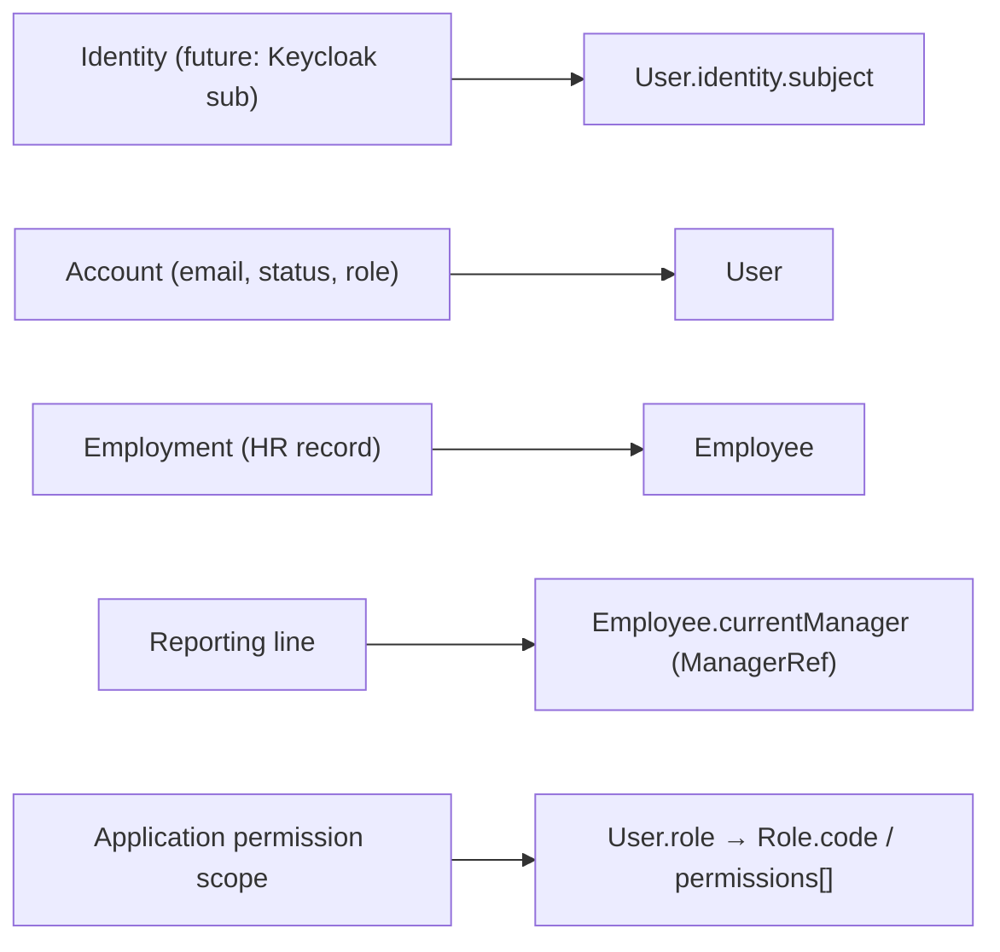

Codebase Guide — How This Application Actually Works

This document assumes you have already read `ARCHITECTURE.md`. That file explains packages, layers, and where to put new code. This one explains **what the system is modeling**, **how real operations unfold in Java**, and **what you must understand before changing behavior**.

The source of truth is the current implementation under `com.acme.leave`. Where the code does not state intent explicitly, the wording is careful: observed behavior first, then likely design intent.

---

## 1. The Business System the Code is Modeling

This is not a generic CRUD app. It models a **single-country workforce leave system** (seed data uses Tunisia via `OrganizationSettings.country = TN`) with four kinds of actors:

- People who **work** and request leave / mark presence (employees).
- People who **supervise** and approve leave / see team availability (managers).
- People who **administer employment and policy** (HR).
- People who **administer accounts and reference data** (system admins).

The important modeling choice is that **login identity and employment are not the same thing**.

| Concept in code                  | What it represents in the business                                                                                                                      |
| -------------------------------- | ------------------------------------------------------------------------------------------------------------------------------------------------------- |
| `User`                           | An **account**: email, optional external identity subject, application role, account lifecycle status. May exist with `employeeId = null` (pure admin). |
| `Employee`                       | An **employment record**: number, profile, assignment, manager, contracts, employment status. May exist before any login is created.                    |
| `Role` + `User.role`             | **Authorization catalog** and the role attached to a user. Application role is stored on `User`, not inferred from Keycloak in the current code.        |
| `Department` / `Position`        | Org catalog entries. Employees do not hold only foreign keys; **current assignment denormalizes labels**.                                               |
| `LeaveType`                      | Category of leave (e.g. paid annual, sick): whether it needs proof, whether it **deducts balance**.                                                     |
| `LeavePolicy`                    | Versioned rules for a country + leave type + effective dates: accrual unit, rates, min block, notice.                                                   |
| `LeaveRequest`                   | A demand for leave with a **state machine** and a **frozen employee snapshot** at creation time.                                                        |
| `LeaveLedger` + `LedgerMovement` | Per employee / leave type / **year** balance book. Balance is not a free-standing editable field; it is maintained by **append-only movements**.        |
| `Attendance`                     | Daily presence toggle (office/remote) for one employee on one date.                                                                                     |
| `Notification`                   | Inbox item for a **user** (account), not for an employee id.                                                                                            |
| `OrganizationSettings`           | Singleton runtime config: country, timezone, weekend day numbers.                                                                                       |

If you only remember one sentence: **the same human being can be a User (can log in), an Employee (is employed), a Manager (appears as `currentManager` on others), and hold a Role (what the API allows)—and those dimensions are deliberately split in storage.**

---

## 2. Identity, Employment, Hierarchy, and Authorization together

### 2.1 Four Dimensions of “A pErson”



**Observed behavior**

- Creating an employee (`EmployeeServiceImpl.create`) does **not** create a user.
- Creating a user (`UserServiceImpl.create`) optionally links `employeeId` after verifying the employee exists; status starts as `PENDING_ACTIVATION`.
- `User.recordLogin` is written for first-login linking: attach `identity.subject` once; reject subject mismatch; activate pending accounts; block suspended/archived.
- Manager relationship is **not** a role alone. Being a manager in the approval sense means: you have an `employeeId`, and other employees list you in `currentManager.employeeId`. Role `MANAGER` is expected in the product story, but the **hard check on approve/reject is the reporting edge**, not the role string.

**Likely design intent**

- HR can onboard employment before IT creates login.
- Pure admins can manage the system without being on the org chart.
- Approvals follow the real reporting line even if role data were wrong.

### 2.2 How “Me” wAlks tHose dImensions

For `/api/v1/me/**`:

1. `CurrentUserService.requireCurrentUser()` loads a `User` by `X-User-Email` (stand-in until JWT).
2. Controllers that need employment call `user.getEmployeeId()` and fail with `FORBIDDEN` if null.
3. Further work uses :
	- EmployeeService
	- leaveService

Clients never pass “my employee id” as a trusted input for ownership; ownership is derived from the resolved user. That is why IDOR protection is centered on comparing `user.employeeId` to resource `employeeId`.

---

## 3. Important Relationships and why They Look the Way They Do

### 3.1 User → Employee (Optional rEference)

- **Meaning:** This account may act as this employment record.
- **Ownership:** Stored on `User.employeeId` (nullable ObjectId string).
- **Not embedded:** Employee is an independent document with its own lifecycle and indexes (`employeeNumber`, profile email).
- **If modeled as one document:** You could not have employees without accounts or accounts without employees without awkward nulls and mixed concerns.

### 3.2 Employee → Department / Position (Embedded aSsignment with dEnormalized lAbels)

On create, if `departmentId` / `positionId` are provided, `EmployeeServiceImpl.buildAssignment` loads Department and Position and builds `Assignment` with **both ids and labels**.

- **Meaning:** “Current org placement.”
- **Why labels are copied:** List/UI paths (team, availability, leave snapshot) can show department/position without joining collections every time.
- **Risk:** If HR renames a department document, existing `Assignment.departmentLabel` values do **not** auto-update. The implementation does not re-resolve labels on every read.
- **History:** `assignmentHistory` and `managerHistory` exist on the entity, but **current create/update paths do not push history** when assignment or manager changes. The fields are prepared for a fuller HR workflow; today update mainly patches profile and employment status.

### 3.3 Employee → Manager (ManagerRef eMbedded)

`ManagerRef` holds `employeeId`, display `name`, and `startDate`.

- **Meaning:** Current reporting line used by manager list, approve, and notification routing.
- **Queried as:** `EmployeeRepository.findByCurrentManagerEmployeeId`.
- **Name is a snapshot** of the manager’s name at assignment time (built from manager profile or employee number). Renaming the manager later does not rewrite subordinates’ `ManagerRef.name` in the current code.

### 3.4 LeaveRequest → Employee (Live iD + fRozen sNapshot)

`LeaveRequest` stores:

- `employeeId` — live reference for ownership, overlap queries, ledger keys.
- `employeeSnapshot` — copy of number, name, email, department/position **labels at draft creation**.

**Observed:** Snapshot is set in `createDraft` via `snapshot(employee)` and is not refreshed on submit/approve.

**Likely intent:** Historical leave records remain readable even if the person later changes department or name. Do not treat snapshot as the place to update current org data.

### 3.5 LeaveRequest → LeaveType (Code + cOpied legalCategory)

Stores `leaveTypeCode` and copies `legalCategory` from the type at creation. Policy is **not** stored on the request; duration uses policy resolution again at create/eligibility time from org country + type + start date.

### 3.6 LeaveLedger → Employee + LeaveType + Year

Unique compound key `(employeeId, leaveTypeCode, year)`. Movements are an **embedded array**. There is no separate movements collection.

### 3.7 Notification → User

Notifications are keyed by `userId` (account). The listener resolves manager/employee **users** via `UserRepository.findByEmployeeId`. If an employee has no linked user, notifications for that person simply are not created (listener uses `ifPresent`).

---

## 4. Current State Vs Historical / Transactional State

| Kind | Examples | Behavior |
|------|----------|----------|
| **Current state** | `Employee.employmentStatus`, `currentAssignment`, `currentManager`, `LeaveRequest.status`, `User.accountStatus`, `LeaveLedger.availableBalance` | What the system believes is true now for decisions. |
| **History / audit** | `statusHistory[]`, ledger `movements[]`, prepared `assignmentHistory` / `managerHistory` | Append-only or intended append-only trail. |
| **Snapshot at event time** | `EmployeeSnapshot` on leave request; manager `name` on `ManagerRef`; labels on `Assignment` | Frozen for display/history; not automatically synced. |
| **Computed, never stored** | Team availability statuses | `AvailabilityServiceImpl` derives status from employees + approved leaves + attendance + weekends. |

**Critical invariant for leave balance:** you never “set availableBalance = 12” as a business operation. HR adjustments and approvals **append a movement**; the service updates aggregates from that movement. Editing an old movement in the database by hand would violate the model the services assume.

---

## 5. Embedded Documents Vs Top-level Collections

Under `domain/entities/embedded/`:

| Embedded type | Parent | Why embedded (from usage) |
|---------------|--------|---------------------------|
| `EmployeeProfile` | Employee | Person attributes of the employment record; no independent repository. |
| `Assignment` | Employee | Current (and history list) placement; not a shared document. |
| `ManagerRef` | Employee | Reporting pointer + display fields. |
| `Contract` | Employee | Employment contracts list on the employee (structure exists; create path initializes empty list). |
| `UserIdentity` | User | External IdP subject linkage. |
| `UserRoleRef` | User | Denormalized role id+code for fast reads without joining roles every time. |
| `EmployeeSnapshot` | LeaveRequest | Point-in-time copy for the request document. |
| `StatusHistoryEntry` | LeaveRequest | Status transition log. |
| `LedgerMovement` | LeaveLedger | Transaction lines of the balance book. |

Top-level collections exist when the concept has **independent lifecycle, uniqueness, or query patterns of its own** (users, employees, leave types, policies, requests, ledgers, attendances, notifications, org settings, roles, departments, positions).

---

## 6. Lifecycles of Major Objects

### 6.1 Employee

```
Create (HR) → ACTIVE by default
     → optional currentAssignment, currentManager
Update → profile fields / employmentStatus
(Terminal) TERMINATED is an enum value; cascade to User is not implemented
```

**Create path details**

1. Reject duplicate `employeeNumber` and profile email.
2. Map request → entity; default status ACTIVE.
3. Initialize empty history and contracts lists.
4. Optionally resolve department/position into assignment.
5. Optionally load manager employee and set `ManagerRef`.
6. Save once.

**Update path** does not currently reassign department/manager via dedicated history-pushing endpoints (those appear in the product roadmap, not as fully separate service methods yet). Changing manager only via a future API would need to push the old `ManagerRef` into `managerHistory`—the lists exist for that purpose.

### 6.2 User

```
Admin create → PENDING_ACTIVATION, role ref set, optional employeeId
recordLogin → link identity, ACTIVE if pending; reject suspended/archived
Admin update → status, role, employeeId link/unlink
```

No self-registration endpoint exists. Unknown email cannot become a user through login alone in the designed model (`recordLogin` assumes an existing user document).

### 6.3 Leave Request

```
DRAFT --submit(owner)--> PENDING --approve(manager)-->  APPROVED
                           |              |
                           reject         cancel(owner) --> CANCELLED
                           v
                        REJECTED
DRAFT/PENDING --cancel(owner)--> CANCELLED
```

Enforced in `LeaveRequestServiceImpl` with `INVALID_STATUS_TRANSITION` when the current status is wrong.

Side effects:

- **Submit / approve / reject / cancel:** publish `LeaveRequestStatusChangedEvent`.
- **Approve** (if type deducts balance): append `APPROVED_LEAVE_DEBIT` before/as part of the same service method (ledger then request save).
- **Cancel when already APPROVED:** append `CANCELLED_LEAVE_CREDIT` if type deducts, then status CANCELLED.

### 6.4 Leave Ledger

Created lazily via `getOrCreate` when eligibility checks balance, when adjusting, or when approve/cancel append movements. Year is taken from the leave **start date** year on request-driven paths.

### 6.5 Attendance

Upsert by `(employeeId, date)`. Source defaults to `SELF`. Used as an input to availability computation, not as leave authorization.

---

## 7. End-to-end Operation Traces

### 7.1 Create Employee — `POST /api/v1/hr/employees`

1. Controller validates `CreateEmployeeRequest`.
2. `EmployeeService.create`:
   - uniqueness checks on number and email;
   - map to entity;
   - optional department/position loads → embedded `Assignment` with labels;
   - optional manager load → embedded `ManagerRef`;
   - `save`.
3. Map to `EmployeeResponse`.

**Does not:** create user, create ledger, send notification.

### 7.2 Create User — `POST /api/v1/admin/users`

1. Unique email; optional employee existence check; role lookup by code.
2. Persist user with `PENDING_ACTIVATION` and `UserRoleRef` (id + code from Role document).
3. **Does not** activate until `recordLogin` (or admin sets status).

### 7.3 Me Profile — `GET /api/v1/me/profile`

1. `CurrentUserService` → `User` by email header.
2. If `employeeId == null` → `FORBIDDEN`.
3. Load employee by id → map to response.

### 7.4 Create Draft Leave — `POST /api/v1/me/leave-requests`

1. Resolve user; require `employeeId`.
2. Load employee; load leave type (must be active).
3. Load org settings; resolve policy for country + type + start date → `AccrualUnit` (default `WORKING_DAY` if no policy).
4. `DurationCalculator.calculate` (weekends from settings; half-day flags).
5. Build request with **snapshot**, status DRAFT, first status history row, save.

**Does not run full eligibility** on draft create. Eligibility runs on **submit** (and is available as a preview endpoint).

### 7.5 Submit Leave — `POST /api/v1/me/leave-requests/{id}/submit`

1. Load request; must be owner; must be DRAFT.
2. Rebuild eligibility inputs from stored request fields.
3. `EligibilityService.check`:
   - employee ACTIVE;
   - leave type active;
   - date order;
   - duration via policy unit + weekends;
   - min block days if policy defines it;
   - no overlap with **APPROVED** leaves (date range intersection);
   - if type deducts balance: `getOrCreate` ledger for start year; compare `availableBalance` to duration.
4. On failure: map reasons to `INSUFFICIENT_BALANCE`, `OVERLAP_DETECTED`, or `VALIDATION_ERROR`.
5. Transition to PENDING; set `submittedAt`; save; **publish event**.
6. Async listener: notify manager’s **user** (via employee’s `currentManager` → user by employee id).

### 7.6 Approve — `POST /api/v1/manager/leave-requests/{id}/approve`

1. Request must be PENDING.
2. Manager user must have `employeeId`.
3. Load subject employee; `currentManager.employeeId` must equal manager’s employee id; manager cannot be the same person as the subject.
4. If leave type `deductsFromBalance`: `appendMovement` debit of `durationDays` (can throw `INSUFFICIENT_BALANCE` here even if eligibility passed earlier—balance may have changed).
5. Transition APPROVED; set validated fields; save; publish event.
6. Listener notifies employee’s user.

### 7.7 Reject

Same manager-of checks; comment **required**; no ledger movement; event → notify employee.

### 7.8 Cancel Approved

Owner only (current implementation). If approved and type deducts: compensating **credit** movement, then CANCELLED + event.

### 7.9 HR Leave Adjustment — `POST /api/v1/hr/leave-adjustments`

Restricted movement types (`HR_ADJUSTMENT_*` / `CORRECTION_*`); builds movement with actor; `appendMovement`. Actor is currently literal `"system"` from the controller (no CurrentUser wiring on that endpoint yet).

### 7.10 Team Availability — `GET /api/v1/manager/team/availability`

Pure read:

1. Team = employees with `currentManager.employeeId =` caller’s employee id.
2. Weekend? → all `NOT_A_WORKING_DAY`.
3. Else approved leave covering date → `ON_LEAVE`.
4. Else attendance row → office/remote mapped to present statuses.
5. Else `NOT_LOGGED_IN`.

Nothing is written.

### 7.11 Notifications List / Mark Read

List by `userId` of current user. Mark read checks ownership of the notification document.

Email path: `notifyUser` always creates IN_APP; then if user has email and mail is enabled, `JavaMailSender` sends plain text. Mail failure is logged, not thrown to the leave flow.

---

## 8. Hidden Business Rules (Human lAnguage)

| Rule | Where enforced | Notes |
|------|----------------|-------|
| No self-registration | User create is admin-only; login linking expects existing user | Product rule in comments on `recordLogin`. |
| Subject linked once | `recordLogin` | Mismatch → FORBIDDEN. |
| Only ACTIVE employees request leave (on submit) | Eligibility | Draft can still be created; submit fails. |
| Overlap only vs APPROVED | Eligibility query | PENDING overlaps are allowed by current code. |
| Duration respects weekends for WORKING_DAY | DurationCalculator | Calendar holidays not applied yet (comment in calculator). |
| Min block days | Eligibility if policy has `minBlockDays` | Compared to calculated duration. |
| Balance cannot go negative on debit | `LeaveLedgerServiceImpl.appendMovement` | Approvals and adjustments. |
| Ledger movements immutable in app logic | append only | Corrections are new movements. |
| Manager-of for approve/reject | `assertManagerOf` | Role is not checked in that method. |
| Cannot approve own leave | same | Even if self-manager data were wrong. |
| Reject requires comment | `reject` | Approve comment optional. |
| Cancel of APPROVED restores balance if type deducts | `cancel` | Compensating credit. |
| Availability never stored | AvailabilityService | Recompute each call. |
| Leave service does not write notifications | Event + listener | Failures in listener do not roll back leave (async, catch log). |

---

## 9. Source of Truth Map

| Question | Authoritative store |
|----------|---------------------|
| Who is logged in (dev)? | `User` found by email header via `CurrentUserService` |
| Application role? | `User.role` (ref to Role); not JWT claims today |
| Employment facts? | `Employee` document |
| Who is my manager? | `Employee.currentManager.employeeId` |
| Leave request status? | `LeaveRequest.status` (+ `statusHistory` for trail) |
| How many days is this request? | `LeaveRequest.durationDays` as stored at create (not recomputed on approve) |
| Leave balance? | `LeaveLedger.availableBalance` maintained by movements for that year |
| Is this type deducted? | `LeaveType.deductsFromBalance` |
| Weekend definition? | `OrganizationSettings.weekendDays` |
| Policy for a date? | Latest active `LeavePolicy` matching country + type + effective window (`LeavePolicyServiceImpl.resolve`) |
| Presence that day? | `Attendance` for (employeeId, date) if exists |
| “Available?” for team UI? | **No document** — computed |
| Inbox? | `Notification` by `userId` |

When the same fact appears twice (e.g. email on User and on Employee.profile), treat them as **related but not automatically synchronized**. Employee create uniqueness uses profile email; user create uses user email. Linking is by id, not by forcing emails equal in code.

---

## 10. Transactions and Multi-document Updates

Services use class-level `@Transactional(readOnly = true)` and method-level `@Transactional` on writes.

**Operations that intentionally touch more than one concern in one service call:**

- **Approve:** ledger movement save + leave request save (same method; relies on Spring transaction + Mongo setup). If ledger debit fails, request should not become APPROVED.
- **Cancel approved:** compensating credit + request status.
- **Submit:** request only (+ event after save). Eligibility may call `getOrCreate` ledger (can insert empty ledger during a read-only eligibility class—eligibility is `readOnly = true` but calls `getOrCreate` which is `@Transactional` write; in practice this can create a zero ledger as a side effect of checking balance).

**Events are published after save** in the leave service. Listeners are `@Async`. Therefore notification/email is **not** in the same transaction as approve. Leave can succeed while notification fails (logged).

---

## 11. Validation and Errors

Flow:

```
Service throws BusinessException / DuplicateResourceException / ResourceNotFoundException
        ↓
GlobalExceptionHandler
        ↓
{ "error": { "code", "message", "details", "requestId" } }
```

Bean validation on DTOs → `VALIDATION_ERROR` with field details.

Examples of business codes used in leave flows: `INVALID_STATUS_TRANSITION`, `INSUFFICIENT_BALANCE`, `OVERLAP_DETECTED`, `FORBIDDEN`, `RESOURCE_NOT_FOUND`, `DUPLICATE_RESOURCE`.

When adding rules, prefer throwing these types with an `ErrorCode` rather than returning ad-hoc maps from controllers.

---

## 12. Controllers as Views over One Model

| Context | Sees leave requests as… | Uses services… |
|---------|-------------------------|----------------|
| `me` | Own drafts and history; submit/cancel | LeaveRequestService with owner checks |
| `manager` | Pending for direct reports; approve/reject | Same service with manager-of checks |
| `hr` | Org-wide list/filter (read-only) | Repository/mapper path in `HrLeaveRequestController` (does not approve) |

Employee data: HR mutates employment; me reads profile; manager lists team via `findByManager`. Logic for “who is on my team” lives once in `EmployeeRepository` / `EmployeeService`, not duplicated in the leave controller.

---

## 13. Design Consequences (Trade-offs pResent in the cOde)

**Easier because of this design**

- Audit-friendly leave balances (movement list).
- Leave documents remain meaningful after org changes (snapshot).
- Pure admins without fake employee rows.
- Availability stays consistent with leaves/attendance without dual-write bugs.

**Harder / sharp edges**

- Denormalized labels can drift from Department/Position documents.
- History arrays on Employee are not fully maintained by current update APIs.
- Eligibility and approve both care about balance—race between two submits is not locked beyond document-level behavior.
- Duration stored at draft time is not recalculated if policy/weekends change before submit (submit re-runs eligibility duration for checks, but the stored `durationDays` on the entity is whatever was set at create unless you add recalculation).
- Notification depends on User linked to manager/employee; missing link → silent skip.
- Manager authorization is reporting-line based; a user with MANAGER role but no reports sees empty team.

---

## 14. Important Invariants

| Invariant | Why | Enforced | If broken |
|-----------|-----|----------|-----------|
| User email unique | Account identity | Index + create check | Duplicate accounts / login ambiguity |
| Employee number unique | HR identity | Index + create check | Duplicate employment records |
| One ledger per emp/type/year | Balance isolation | Compound index + getOrCreate | Split balances, wrong deductions |
| Leave status only moves on allowed edges | Process integrity | LeaveRequestServiceImpl | Impossible states, wrong ledger side effects |
| Debit only if availableBalance sufficient | No negative leave stock | appendMovement | Over-granted leave |
| Approve only for currentManager’s reports | Org authority | assertManagerOf | Cross-team approval |
| Availability not persisted | Single derivation path | No write API | Stale “available” flags if someone added writes later |
| Notifications created outside leave service | Separation of concerns | Event listener only | Tight coupling / dual writes if reintroduced in service |

---

## 15. How to Change the Code Safely

### Adding a Field to Employee Visible on APIs

1. Entity (and embedded if needed).
2. Request and/or response DTOs.
3. Mapper mappings.
4. Service create/update if business defaults apply.
5. Consider whether leave `EmployeeSnapshot` should capture it at request creation—if yes, update `snapshot()` and snapshot class.

### Changing Leave Eligibility

Edit `EligibilityServiceImpl` first. Re-test submit path (not only the eligibility preview endpoint). Remember approve can still fail on balance.

### Changing Approve Behavior

Touch `LeaveRequestServiceImpl.approve`, `LeaveLedgerServiceImpl.appendMovement`, and be aware of `NotificationEventListener`. Changing status without publishing events will stop inbox/email updates.

### Changing “Who is mAnager”

Today team and approval use `currentManager.employeeId`. Any new reassignment API must update that field and should push previous ref to `managerHistory` if you want history to stay honest.

### Choosing Admin / Hr / Manager / Me for a New Endpoint

- Acts on **self** using auth context → `me`
- Acts on **direct reports** → `manager`
- Acts on **org-wide employment/policy** → `hr`
- Acts on **accounts, roles, catalogs, org settings** → `admin`

Prefer calling existing services rather than re-implementing manager-of or ownership checks in a new controller.

### Keycloak (When iMplemented)

Replace header resolution inside `CurrentUserService` with JWT `sub`/`email` lookup; keep loading `User` from Mongo for role and `employeeId`. Do not move application role authority to token claims without a deliberate product decision—the code is structured around `users.role` as source of truth.

---

## 16. How to Think about This Codebase

Think in layers of meaning, not folders:

```
Identity & account (User, Role, future Keycloak)
        ↓
Employment & hierarchy (Employee, Assignment, ManagerRef)
        ↓
Configuration (OrganizationSettings, LeaveType, LeavePolicy)
        ↓
Workforce operations (LeaveRequest state machine, Attendance)
        ↓
Financial-style leave stock (LeaveLedger movements)
        ↓
Derived views (Availability)
        ↓
Side effects (events → Notification + email)
```

Principles that match the implementation:

1. **Business operations, not bare CRUD** — submit/approve/adjust are workflows with rules and side effects.
2. **Follow the service method** — controllers are thin; the real story is in `*ServiceImpl`.
3. **Separate identity from employment** — always know which id you have (user id vs employee id).
4. **Separate current state from snapshots and movements** — do not “fix” history by rewriting past rows.
5. **Look for side effects** before changing leave status methods (ledger + events).
6. **Reuse** eligibility, ledger append, and manager-of checks instead of copying.
7. **Computed availability** must stay computed unless the product deliberately introduces a cache with invalidation.

If you open one file only, open `LeaveRequestServiceImpl`: it is where identity, employment, policy, duration, eligibility, ledger, state machine, and notifications all meet.
